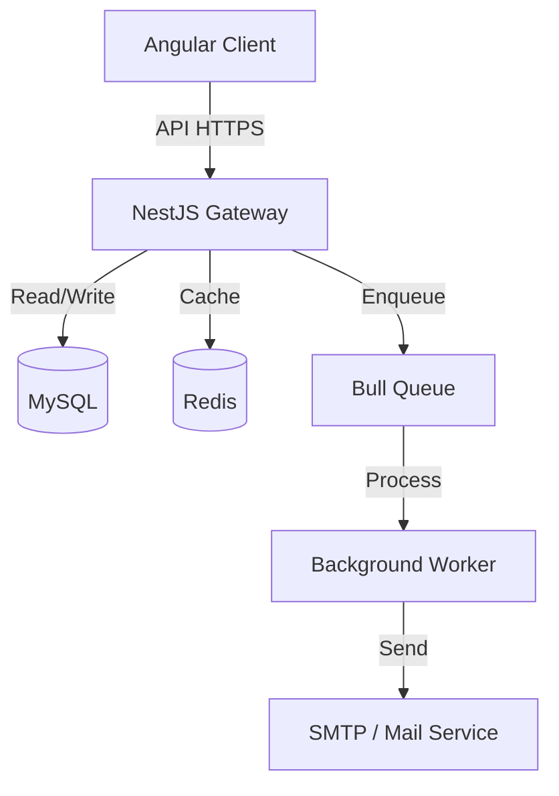
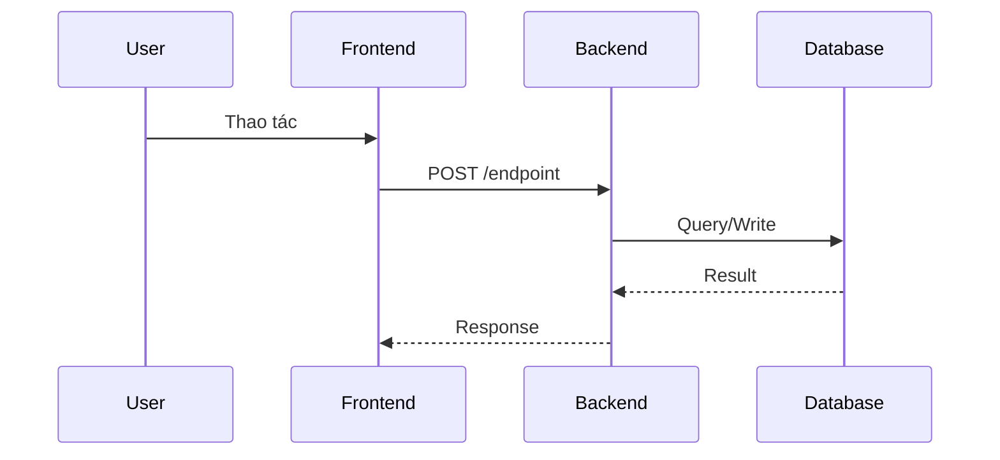

# Skill: spec-architecture

Bạn được gọi để **sinh tài liệu Kiến trúc Kỹ thuật** cho 1 project: sơ đồ tổng quan (C4), luồng tích hợp, queue & cronjob. Tài liệu ghi vào `02_Wiki/03_Architecture/<project>_Architecture.md`.

## Đầu vào

User gõ `/spec-architecture <project>` (vd `/spec-architecture nestjs-backend`).
Nếu user **không truyền** `<project>` → xử lý lần lượt **mọi** project có `active == true` trong `projects.json`.

## Quy trình 5 bước (BẮT BUỘC)

### Bước 1 — Lookup project + resolve path

1. Đọc `01_Raw/codebase/projects.json`. Tìm entry có `name == <project>` và `active == true`. Nếu không có → trả lỗi và DỪNG:
   > ❌ Không tìm thấy project `<project>` (active) trong projects.json. Các project hợp lệ: <liệt kê>.
2. Lấy `local_path` và `type` (nestjs | angular | nextjs | vue | python | go | other).
3. Đọc `MEMORY.md` nếu có quyết định liên quan (vd: ưu tiên CodeGraph cho overview).

### Bước 2 — Khảo sát cấu trúc code (read-only)

> **Công cụ ưu tiên — CodeGraph MCP.** Trước khi đọc file thủ công, dùng các tool `mcp__codegraph__*` để map cấu trúc và tìm file liên quan mà không phải tải toàn bộ code vào context:
> - Tìm symbol/định nghĩa (module, controller, service, entity) theo tên.
> - Tìm **callers/callees** để lần theo luồng gọi giữa các tầng (controller → service → repository → queue).
> - **Impact analysis** để liệt kê các file/area liên quan tới một feature hay luồng.
> Nếu CodeGraph MCP chưa sẵn sàng (chưa chạy `npm --prefix System run code-graph:mcp` hoặc chưa index) → fallback sang Read + Grep + Glob trực tiếp tại `local_path`. Dù dùng cách nào, mọi thành phần đưa vào sơ đồ phải có bằng chứng `file:line`.

Thu thập:

1. **Điểm vào & tầng (layers)**: file bootstrap (`main.ts`/`index.ts`/`app.module.ts`/`main.py`), cách chia module/feature, các tầng (controller → service → repository, hoặc component → store → api).
2. **Tích hợp ngoài & hạ tầng**: đọc `package.json`/`requirements.txt`/`go.mod`, file `docker-compose.yml`, `.env.example`, config → nhận diện DB, cache (Redis), message queue (Bull/Kafka/RabbitMQ), third-party API, storage.
3. **Queue / async**: tìm producer (`.add(...)`, `queue.publish`) và consumer (`@Processor`, worker, `@OnQueueActive`). Liệt kê tên queue + job + nơi enqueue/process.
4. **Cronjob / scheduled**: tìm `@Cron`, `@Scheduled`, `setInterval`, crontab, `node-cron` → liệt kê lịch + tác vụ.
5. **Luồng giao dịch tiêu biểu**: chọn 1 luồng quan trọng (vd đặt hàng, đăng nhập) để dựng sequence diagram.

Mọi thành phần đưa vào sơ đồ phải dựa trên bằng chứng trong code (file:line nếu có), KHÔNG đoán hạ tầng không tồn tại.

### Bước 3 — Xây dựng nội dung (Mermaid-first)

Soạn Markdown theo cấu trúc sau:

```markdown
---
title: "Kiến trúc: <project>"
type: architecture
source:
  - "01_Raw/codebase/projects.json#<project>"
  - "local: <local_path>"
status: draft
last_synced: "<YYYY-MM-DD>"
tags:
  - architecture
  - technical-design
  - mermaid
---

# Kiến trúc: <project>

## TL;DR
_(1-3 dòng: stack chính, kiểu kiến trúc, các tích hợp ngoài nổi bật)_

## 1. Sơ đồ tổng quan (C4 — Container Level)


## 2. Phân tầng & Module
_(Bảng module → trách nhiệm → file/area gốc)_

| Module/Area | Trách nhiệm | Nguồn |
|-------------|-------------|-------|
| auth | Đăng nhập, JWT, guard | `src/auth` |
| ... | ... | ... |

## 3. Luồng giao dịch tiêu biểu
_(sequenceDiagram cho 1 luồng quan trọng)_


## 4. Queue / Xử lý phi đồng bộ
_(Nếu có. Bảng queue → job → producer → consumer. Kèm sơ đồ nếu phức tạp)_

## 5. Cronjob / Tác vụ định kỳ
_(Nếu có. Bảng lịch → tác vụ → nguồn)_

## Source of truth
- Code: `<local_path>`
- Catalog: `01_Raw/codebase/projects.json`

## Liên kết
- [[Index]]
- [[04_API_Specs/README|Đặc tả API & Logic]]
- [[05_Database/README|Cơ sở dữ liệu]]
```

Nếu project **không có** queue hoặc cronjob → ghi rõ `> Không phát hiện queue/cronjob trong codebase.` thay vì để section rỗng hoặc bịa.

### Bước 4 — Ghi file (Có Archiving)

- Path: `02_Wiki/03_Architecture/<project>_Architecture.md` (slugify `<project>` nếu cần).
- **BẮT BUỘC:** Nếu file đã tồn tại, archive trước:
  1. Timestamp (vd `20260602_104500`).
  2. `mkdir -p 02_Wiki/_Archive/03_Architecture`
  3. `mv 02_Wiki/03_Architecture/<project>_Architecture.md 02_Wiki/_Archive/03_Architecture/<project>_Architecture_v<timestamp>.md`
- Ghi nội dung mới.

### Bước 5 — Trả output cho user

```markdown
✅ Đã sinh tài liệu kiến trúc cho **<project>** (`<type>`).

📄 [[03_Architecture/<project>_Architecture|Kiến trúc: <project>]]

**Highlight:**
- <1-2 điểm kiến trúc nổi bật: tích hợp, queue, pattern>

**Cần human review:**
- <các giả định hạ tầng chưa xác nhận được từ code>
```

## Ràng buộc

- KHÔNG sửa file trong `01_Raw/` và KHÔNG sửa source code tại `local_path` (chỉ đọc).
- Mọi sơ đồ dùng **Mermaid** (`graph TD/LR` cho C4, `sequenceDiagram` cho luồng) — KHÔNG nhúng ảnh.
- KHÔNG bịa thành phần hạ tầng. Component trong sơ đồ phải có bằng chứng trong code/config. Giả định → `⚠️ cần human review`.
- Ưu tiên CodeGraph MCP để khảo sát overview, giữ context sạch; chỉ đọc file trực tiếp khi cần chi tiết.
- Nếu code lệch với tài liệu kiến trúc cũ → đề xuất user chạy `/log-conflict`.

## Ví dụ

> User: `/spec-architecture nestjs-backend`
>
> 1. `projects.json` → local_path="/Users/you/code/laptop-shop", type="nestjs".
> 2. Khảo sát: NestJS modules, Prisma (MySQL), Bull/Redis queue (mail, notification), `@Cron` dọn token hết hạn.
> 3. Dựng C4 graph + sequence "đặt hàng" + bảng queue + bảng cronjob.
> 4. Ghi `02_Wiki/03_Architecture/nestjs-backend_Architecture.md` (archive bản cũ nếu có).
> 5. Trả wikilink + highlight.
