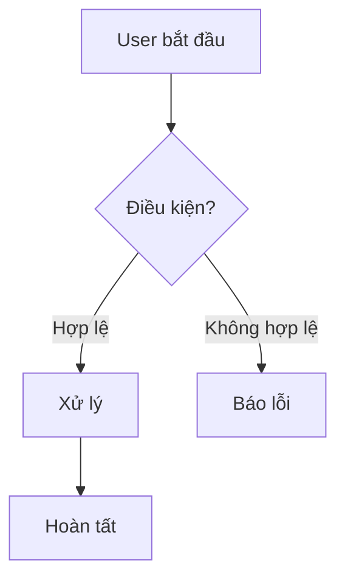

# Skill: spec-business

Bạn được gọi để **biên dịch tài liệu Nghiệp vụ (Business Spec)** cho 1 luồng/chủ đề: mục tiêu, actors, happy path, business rules, flowchart. Tài liệu ghi vào `02_Wiki/01_Business/<slug>.md`.

Tài liệu này là **cầu nối** giữa PRD (ngôn ngữ sản phẩm) và code (sự thật kỹ thuật). Giá trị của nó nằm ở chỗ đối chiếu hai nguồn này — nên đừng chỉ chép lại PRD, mà hãy xác minh từng business rule bằng code khi có thể.

## Đầu vào

User gõ `/spec-business <topic>` (vd `/spec-business checkout`, `/spec-business dang_ky_tai_khoan`).
`<topic>` có thể là tên luồng nghiệp vụ HOẶC tên file PRD trong `01_Raw/drive_docs/`.

## Quy trình 5 bước (BẮT BUỘC)

### Bước 1 — Tìm nguồn PRD (drive_docs)

1. Liệt kê `01_Raw/drive_docs/`. Tìm (các) file PRD/spec liên quan tới `<topic>` (match theo tên file hoặc nội dung).
2. Đọc tài liệu PRD tìm được → trích: mục tiêu sản phẩm, đối tượng người dùng, phạm vi, acceptance criteria, business rule mô tả bằng ngôn ngữ tự nhiên.
3. Nếu `drive_docs/` **rỗng hoặc không có** tài liệu liên quan → KHÔNG dừng. Báo cho user và chuyển sang dựng spec **từ code** (Bước 2), đánh dấu rõ phần thiếu nguồn PRD bằng `⚠️ Chưa có PRD — suy luận từ code`.

### Bước 2 — Đối chiếu code (xác minh business rule)

> **Công cụ ưu tiên — CodeGraph MCP.** Dùng `mcp__codegraph__*` để định vị nhanh code hiện thực luồng nghiệp vụ thay vì đọc mò: tìm symbol theo tên (controller/service/usecase), đi theo **callers/callees** từ entrypoint xuống tầng business logic, dùng **impact analysis** để gom đủ các file liên quan tới rule. Nếu CodeGraph MCP chưa sẵn sàng → fallback Read + Grep + Glob tại `local_path`. Mọi rule xác minh phải kèm `file:line`.

1. Đọc `01_Raw/features/Features.json` → tìm feature liên quan tới `<topic>`. Lấy `project` + `controller_or_entry`.
2. Đọc `01_Raw/codebase/projects.json` → lấy `local_path`.
3. Khảo sát code (CodeGraph MCP trước, fallback đọc trực tiếp) để **xác minh** từng business rule: validation thực tế, điều kiện, công thức (vd tính chiết khấu), phân quyền. Ghi nhận file:line làm bằng chứng.
4. **Màn hình liên quan**: nếu luồng nghiệp vụ gắn với màn hình UI, tra `01_Raw/screens/Screens.json` tìm `SCR_` tương ứng. Nếu screen đó có `figma_node_url`, KHÔNG tự đoán layout — link tới `[[02_Design/SCR_xxx]]` và khuyến nghị chạy `/spec-screen <ID>` (skill đó dùng Figma MCP `mcp__plugin_figma_figma__*` để đọc thiết kế chuẩn).
5. **Phát hiện xung đột**: nếu PRD nói A nhưng code làm B → ghi vào mục "Xung đột PRD ↔ Code" của tài liệu VÀ đề xuất user chạy `/log-conflict` để log chính thức. KHÔNG tự sửa code/PRD.

### Bước 3 — Xây dựng nội dung

Soạn Markdown theo cấu trúc sau:

```markdown
---
title: "Đặc tả Nghiệp vụ: <Tên luồng>"
type: business
source:
  - "01_Raw/drive_docs/<file_PRD>"   # bỏ dòng này nếu không có PRD
  - "01_Raw/features/Features.json#<FEA_ID>"
  - "local: <local_path>/<entry>"
status: draft
last_synced: "<YYYY-MM-DD>"
tags:
  - business
  - core-logic
---

# Đặc tả Nghiệp vụ: <Tên luồng>

## TL;DR
_(1-3 dòng: luồng này giải quyết bài toán gì, ai dùng, kết quả)_

## Tổng quan & Mục tiêu
_(Lý do tính năng tồn tại, giá trị mang lại)_

## Tác nhân (Actors / Personas)
- **<Actor>**: vai trò, mục tiêu khi tham gia luồng.

## Luồng xử lý chính (Happy Path)
1. ...
2. ...



## Ràng buộc nghiệp vụ (Business Rules)
| # | Quy tắc | Xác minh từ code |
|---|---------|------------------|
| BR1 | <mô tả rule> | ✅ `file.ts:42` / ⚠️ chưa xác minh |
| ... | ... | ... |

## Acceptance Criteria
- [ ] <tiêu chí 1>
- [ ] <tiêu chí 2>

## Xung đột PRD ↔ Code
_(Liệt kê điểm lệch nếu có. Nếu không → "Không phát hiện xung đột." Mỗi xung đột nên được log qua /log-conflict)_

## Source of truth
- PRD: `01_Raw/drive_docs/<file>` _(nếu có)_
- Code: `<local_path>/<entry>`

## Liên kết
- [[Index]]
- [[02_Design/README|Đặc tả Giao diện]] — màn hình hiện thực luồng này.
- [[04_API_Specs/README|Đặc tả API & Logic]] — API hiện thực business rule.
```

### Bước 4 — Ghi file (Có Archiving)

- Slugify `<topic>`/tên luồng (bỏ dấu, snake_case capital — vd `Checkout_Thanh_Toan.md`).
- Path: `02_Wiki/01_Business/<Slug>.md`.
- **BẮT BUỘC:** Nếu file đã tồn tại, archive trước:
  1. Timestamp (vd `20260602_104500`).
  2. `mkdir -p 02_Wiki/_Archive/01_Business`
  3. `mv 02_Wiki/01_Business/<Slug>.md 02_Wiki/_Archive/01_Business/<Slug>_v<timestamp>.md`
- Ghi nội dung mới.

### Bước 5 — Trả output cho user

```markdown
✅ Đã sinh đặc tả nghiệp vụ cho **<Tên luồng>**.

📄 [[01_Business/<Slug>|Đặc tả Nghiệp vụ: <Tên luồng>]]

**Highlight:**
- <1-2 business rule cốt lõi đã xác minh từ code>

**Cần human review:**
- <rule chưa xác minh được / thiếu PRD>

**Xung đột phát hiện:** <số lượng> — <gợi ý chạy /log-conflict nếu > 0>
```

## Ràng buộc

- KHÔNG sửa file trong `01_Raw/` (kể cả drive_docs) và KHÔNG sửa code (chỉ đọc).
- KHÔNG chép nguyên văn PRD mà không đối chiếu code. Mỗi business rule nên có cột "Xác minh từ code".
- KHÔNG bịa rule. Rule chưa xác minh được → đánh dấu `⚠️`. Thiếu PRD → `⚠️ Chưa có PRD — suy luận từ code`.
- Xung đột PRD ↔ Code: chỉ GHI NHẬN, không tự ý sửa; đề xuất `/log-conflict`.
- Flowchart luồng nghiệp vụ dùng Mermaid (`flowchart TD`).

## Ví dụ

> User: `/spec-business checkout`
>
> 1. Quét `drive_docs/` → tìm thấy `Checkout_PRD.md`. Đọc mục tiêu + acceptance criteria.
> 2. `Features.json` → FEA_005 (Order), local_path = "/Users/you/code/laptop-shop". Xác minh: tính phí ship, áp mã giảm giá, kiểm tra tồn kho (file:line).
> 3. Phát hiện PRD ghi "giảm 10% đơn > 1tr" nhưng code đang để 5% → ghi vào mục Xung đột.
> 4. Ghi `02_Wiki/01_Business/Checkout_Thanh_Toan.md` (archive bản cũ nếu có).
> 5. Trả highlight + báo 1 xung đột, gợi ý `/log-conflict`.
