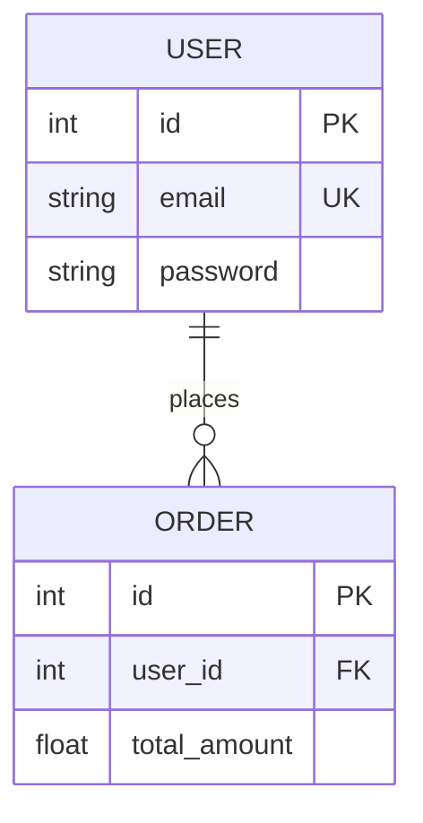

# Skill: spec-database

Bạn được gọi để **sinh tài liệu Cơ sở dữ liệu** (ERD + Từ điển dữ liệu) cho 1 schema. Tài liệu sẽ được ghi vào `02_Wiki/05_Database/<name>_Schema.md`.

## Đầu vào

User gõ `/spec-database <name>` (vd `/spec-database laptop-shop-db`).
Nếu user **không truyền** `<name>` → xử lý lần lượt **mọi** schema có `active == true` trong `schemas.json`.

## Quy trình 5 bước (BẮT BUỘC)

### Bước 1 — Lookup schema + resolve file path

1. Đọc `01_Raw/database/schemas.json`. Tìm entry có `name == <name>`. Nếu không có → trả lỗi và DỪNG:
   > ❌ Không tìm thấy schema `<name>` trong schemas.json. Các name hợp lệ: <liệt kê>.
2. Lấy `local_path` (đường dẫn tới file schema thật) và `type` (prisma | sql | typeorm | drizzle | mongoose | other) + `db_engine`.
3. Nếu `local_path` không tồn tại trên đĩa → trả lỗi:
   > ❌ File schema không tồn tại: `<local_path>`. Kiểm tra lại entry trong schemas.json.

### Bước 2 — Đọc & phân tích schema (read-only)

Mở file tại `local_path` (chỉ ĐỌC, KHÔNG sửa file gốc). Trích xuất theo `type`:

- **prisma**: mỗi block `model X { ... }` là 1 bảng. Với từng field lấy: tên, kiểu, modifier (`?` nullable, `[]` list), attribute (`@id`, `@unique`, `@default`, `@relation(...)`, `@updatedAt`). Quan hệ suy ra từ `@relation` và field kiểu model khác.
- **sql**: mỗi `CREATE TABLE x (...)` là 1 bảng. Lấy column, kiểu, `PRIMARY KEY`, `FOREIGN KEY ... REFERENCES`, `UNIQUE`, `NOT NULL`, `DEFAULT`.
- **typeorm**: class có `@Entity()`; field có `@Column`, `@PrimaryGeneratedColumn`, `@ManyToOne`/`@OneToMany`/`@ManyToMany`/`@JoinColumn`.
- **drizzle**: `pgTable`/`mysqlTable(...)`; cột + `.references(() => ...)`.
- **mongoose**: `new Schema({...})`; field + `ref` cho quan hệ.

Nếu file quá lớn, đọc theo từng phần nhưng PHẢI bao quát hết các bảng. Mọi quan hệ phải bắt nguồn từ định nghĩa thật trong file, KHÔNG đoán.

> **Làm giàu bằng CodeGraph MCP (tùy chọn nhưng nên làm).** Sau khi có danh sách bảng/model, dùng `mcp__codegraph__*` để tìm nơi code đọc/ghi từng bảng (repository, service, query): tìm symbol theo tên model rồi xem callers. Kết quả giúp viết cột "Mô tả" chính xác hơn và bổ sung link `[[04_API_Specs/...]]` cho mục "Quan hệ chính". Nếu CodeGraph MCP chưa sẵn sàng → bỏ qua phần làm giàu này, vẫn sinh ERD + Data Dictionary từ file schema.

### Bước 3 — Xây dựng nội dung (ERD + Data Dictionary)

Soạn nội dung Markdown theo cấu trúc sau:

```markdown
---
title: "Schema: <name>"
type: schema
source:
  - "01_Raw/database/schemas.json"
  - "local: <local_path>"
status: draft
last_synced: "<YYYY-MM-DD>"
tags:
  - database
  - schema
  - ERD
---

# Schema: <name> · `<db_engine>`

## TL;DR
_(1-3 dòng: schema này lưu trữ gì, số bảng, các cụm bảng chính)_

## Sơ đồ ERD


_(Vẽ đầy đủ bảng + quan hệ thực tế. Dùng đúng cardinality: `||--o{` one-to-many, `||--||` one-to-one, `}o--o{` many-to-many)_

## Từ điển dữ liệu (Data Dictionary)

### Bảng `<table_name>`
| Cột | Kiểu | Khóa/Ràng buộc | Nullable | Mô tả |
|-----|------|----------------|----------|-------|
| id | int | PK, auto-increment | No | Khóa chính |
| ... | ... | ... | ... | ... |

_(Lặp lại cho từng bảng. Cột "Mô tả" suy luận từ tên/ngữ cảnh; nếu không chắc → ghi `⚠️ cần review`)_

## Quan hệ chính
- `USER` 1—N `ORDER` _(user_id)_
- ...

## Source of truth
- Schema file: `<local_path>`
- Catalog: `01_Raw/database/schemas.json`

## Liên kết
- [[Index]]
- [[04_API_Specs/README|Đặc tả API & Logic]] — API đọc/ghi các bảng này.
- [[03_Architecture/README|Kiến trúc Hệ thống]]
```

### Bước 4 — Ghi file (Có Archiving)

- Path: `02_Wiki/05_Database/<name>_Schema.md` (slugify `<name>` nếu có ký tự đặc biệt, vd `laptop-shop-db` → `laptop_shop_db`).
- **BẮT BUỘC:** Nếu file đã tồn tại, archive trước khi ghi đè:
  1. Timestamp hiện tại (vd `20260602_104500`).
  2. `mkdir -p 02_Wiki/_Archive/05_Database`
  3. `mv 02_Wiki/05_Database/<name>_Schema.md 02_Wiki/_Archive/05_Database/<name>_Schema_v<timestamp>.md`
- Ghi nội dung mới vào path.

### Bước 5 — Update `schemas.json`

Sửa entry tương ứng trong `01_Raw/database/schemas.json`: thêm/cập nhật `status = "draft"` và `last_synced = "<YYYY-MM-DD>"` (hôm nay). KHÔNG đụng tới các field khác.

### Cuối cùng — Trả output cho user

```markdown
✅ Đã sinh tài liệu DB cho **<name>** (`<db_engine>`, <số_bảng> bảng).

📄 [[05_Database/<name>_Schema|Schema: <name>]]

**Highlight:**
- <1-2 cụm bảng/quan hệ nổi bật>

**Cần human review:**
- <các cột/quan hệ chưa chắc, đánh dấu ⚠️>
```

## Ràng buộc

- KHÔNG sửa file schema gốc tại `local_path` (chỉ đọc).
- KHÔNG sửa file trong `01_Raw/` (ngoại trừ update `status`/`last_synced` trong schemas.json ở bước 5).
- KHÔNG bịa bảng/cột/quan hệ. Mọi thực thể phải xuất phát từ định nghĩa thật trong file schema. Mô tả không chắc → `⚠️ cần review`.
- Sơ đồ luôn dùng `erDiagram` của Mermaid để version-control bằng git.
- Nếu phát hiện schema lệch với tài liệu đã có trong `02_Wiki/` → đề xuất user chạy `/log-conflict` để ghi nhận.

## Ví dụ

> User: `/spec-database laptop-shop-db`
>
> 1. Đọc `schemas.json` → entry: type="prisma", db_engine="mysql", local_path="/Users/you/code/laptop-shop/prisma/schema.prisma".
> 2. Đọc file Prisma → 12 model (User, Product, Order, OrderItem, Category...).
> 3. Dựng `erDiagram` + bảng Data Dictionary cho từng model.
> 4. Ghi `02_Wiki/05_Database/laptop_shop_db_Schema.md` (archive bản cũ nếu có).
> 5. Update `schemas.json`: status="draft", last_synced="2026-06-02".
