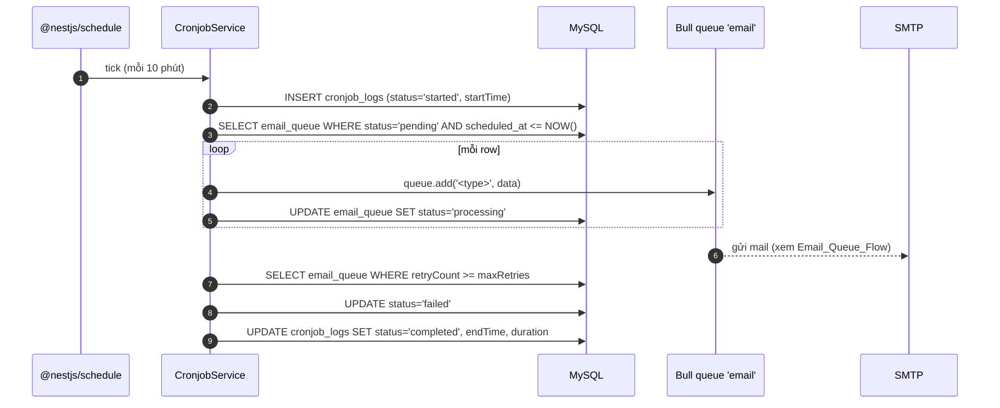
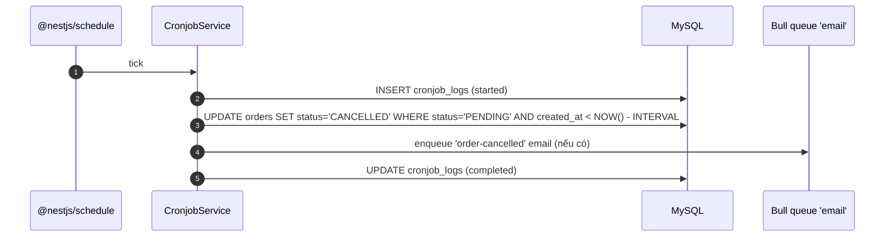

# Cronjob Flow

Module `src/cronjob/` dùng **`@nestjs/schedule`** chạy 2 job định kỳ và ghi log vào MySQL.

## Lịch chạy

| Job name | Schedule | Trách nhiệm |
|----------|----------|-------------|
| `cancel-expired-orders` | `EVERY_10_MINUTES` | Hủy order `PENDING` quá hạn |
| `queue-maintenance` | `EVERY_10_MINUTES` | Quét `email_queue`: retry pending, đánh dấu failed quá `maxRetries`, dọn rows cũ |

(Đọc tại `cronjob.service.ts:32` và `cronjob.service.ts:115`.)

## Sequence — `queue-maintenance`



## Sequence — `cancel-expired-orders`



## Lifecycle log

Mỗi job emit 2 row vào `cronjob_logs`:
- 1 row `status='started'` lúc bắt đầu.
- 1 row update `status='completed'|'failed'`, `endTime`, `duration` (ms), `error` (nếu fail).

→ Admin xem qua `GET /cronjob/logs` (xem [[Cronjob_API]]).

## Quan hệ với các thành phần khác

```mermaid
flowchart LR
  Sched[@nestjs/schedule] --> Cron[CronjobService]
  Cron --> EmailQ[(email_queue)]
  Cron --> Orders[(orders)]
  Cron --> Logs[(cronjob_logs)]
  EmailQ --> BullProcessor[EmailProcessor]
  BullProcessor --> SMTP[SMTP]
```

## Edge cases
- **Overlap**: nếu job trước chưa xong mà tick mới đến, `@nestjs/schedule` mặc định **không khoá** → cần đảm bảo idempotent (service hiện chỉ update theo điều kiện WHERE, an toàn).
- **Service restart giữa job**: row `cronjob_logs` `started` không có row `completed` → admin biết job bị abort, có thể quan sát qua `/cronjob/logs`.
- **DB down**: schedule vẫn tick nhưng thao tác fail → log vào console.

## Liên kết
- Endpoint admin → [[Cronjob_API]]
- Flow gửi mail chi tiết → [[Email_Queue_Flow]]
- Bảng `cronjob_logs`, `email_queue`, `orders` → [[Schema_Design]]
- Kiến trúc tổng → [[System_Overview]]
