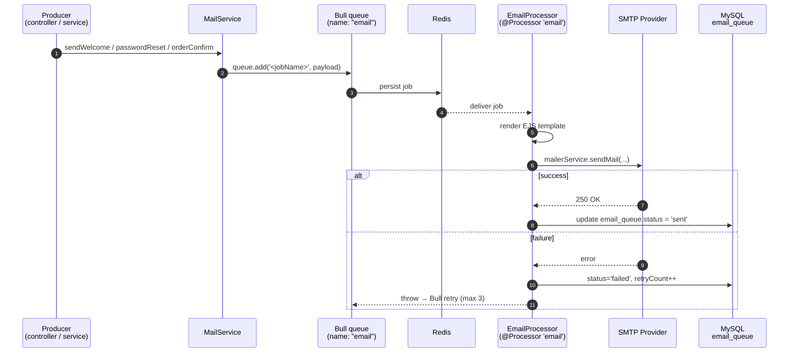

# Email Queue Flow

Module `src/mail/` xử lý gửi email **bất đồng bộ qua Bull** trên Redis.

## Sequence

## Job types (xem `processors/email.processor.ts`)

| Job name | Trigger | Template EJS |
|----------|---------|--------------|
| `welcome` | Sau khi user đăng ký | `welcome.ejs` |
| `password-reset` | Khi yêu cầu reset password | `password-reset.ejs` |
| `order-confirmation` | Sau khi tạo order thành công | `order-confirmation.ejs` |

## Bảng `email_queue` (MySQL)
Đóng vai trò **outbox**: lưu lại mọi email được enqueue để retry/persist khi Redis sập hoặc job lỗi nhiều lần.

Field chính (chi tiết → [[Schema_Design]]):
- `status`: `pending | processing | sent | failed`
- `retryCount` / `maxRetries` (mặc định 3)
- `scheduledAt` / `processedAt`
- `data Json`: payload gốc (template vars)

## Edge cases
- **Redis down** → Bull không add được job → controller throw → fallback insert thẳng vào `email_queue` (status `pending`) cho cronjob retry sau.
- **Quá `maxRetries`** → `status='failed'`, ghi `error`, không xoá row để admin tra cứu.
- **SMTP rate limit** → Bull tự backoff exponential.

## Tham chiếu
- Dashboard queue: `bull-board` mount ở `/admin/queues` (xem `app.module.ts`).
- Cronjob retry → [[System_Overview]] (module `cronjob/`).
- Schema bảng → [[Schema_Design]] (`email_queue`).
