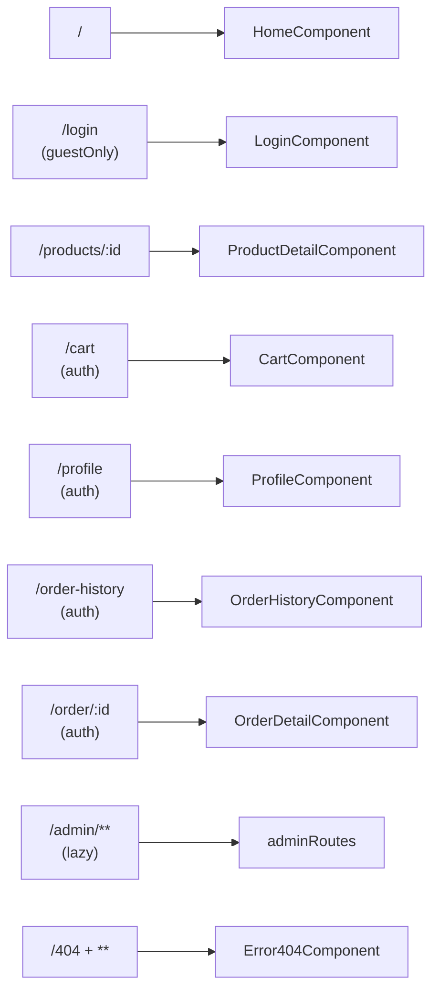
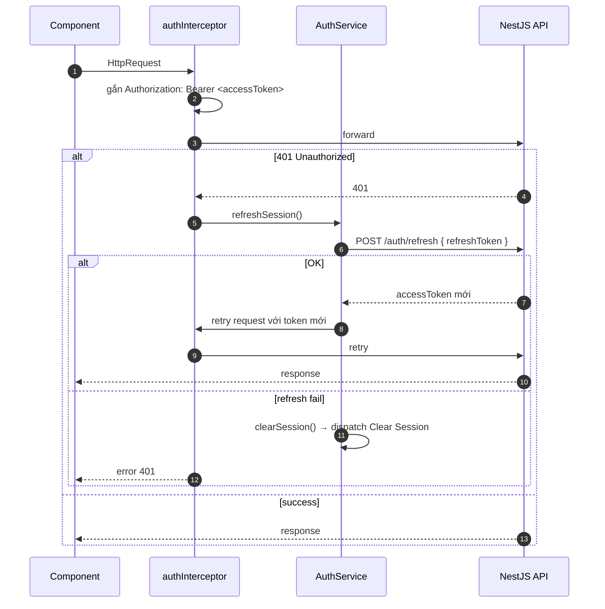

# Frontend Overview — `angular-frontend`

Angular 21 SPA + SSR cho dự án laptop-shop, dùng standalone components, NgRx Store, Tailwind 4.

## Stack

| Layer | Tech | Ghi chú |
|-------|------|---------|
| Framework | **Angular 21** (`@angular/core`) | Standalone components, không NgModule |
| Render | **`@angular/ssr` + Express** | Server `dist/laptop-shop-angualar/server/server.mjs` |
| Routing | `@angular/router` | Lazy `loadComponent` / `loadChildren` |
| State | **NgRx Store 21** (`provideStore`) | Feature key `auth` |
| HTTP | `provideHttpClient(withFetch())` + interceptor | Tự gắn JWT, auto refresh |
| Styling | **Tailwind 4** + PostCSS | `@tailwindcss/postcss` |
| Hydration | `provideClientHydration(withEventReplay())` | Replay events sau hydration |
| Build | `@angular/build` | Lệnh: `ng serve` / `ng build` |

## Cấu trúc `src/app/`

```
app/
├── app.ts                       # root component
├── app.config.ts                # providers: router, store, http, hydration
├── app.config.server.ts         # SSR providers
├── app.routes.ts                # routes (client)
├── app.routes.server.ts         # render mode per-route
├── client/                      # khu vực end-user
│   ├── home/                    # /
│   ├── auth/                    # /login (guestOnlyGuard)
│   ├── product/                 # /products/:id
│   ├── cart/                    # /cart (authGuard)
│   ├── order/                   # /order/:id (authGuard)
│   ├── order-history/           # /order-history (authGuard)
│   └── profile/                 # /profile (authGuard)
├── admin/                       # /admin (lazy adminRoutes)
│   ├── layout/
│   └── dashboard/
├── error/                       # /404 (Error404Component)
└── shared/
    ├── components/              # UI tái sử dụng
    ├── models/                  # interfaces (User, …)
    ├── services/auth.service.ts # gọi /auth/login|register|refresh|logout
    ├── guards/auth.guard.ts     # block route nếu không có accessToken
    ├── guards/guest-only.guard.ts # block route /login nếu đã đăng nhập
    ├── interceptors/auth.interceptor.ts # gắn JWT + auto refresh khi 401
    └── store/auth/              # NgRx feature 'auth'
        ├── auth.actions.ts
        ├── auth.reducer.ts
        ├── auth.state.ts
        ├── auth.selectors.ts
        └── index.ts
```

## Bản đồ route



## SSR — render mode per route (`app.routes.server.ts`)

| Path | Mode | Lý do |
|------|------|-------|
| `/login`, `/cart`, `/profile`, `/order-history`, `/order/:id`, `/products/:id` | **Client** | Phụ thuộc user state / data động → render ở browser |
| `**` (mọi route khác, gồm `/`) | **Prerender** | Trang public → prerender static lúc build |

## NgRx Store

Feature key **`auth`** (file `shared/store/auth/`).

```ts
interface AuthState {
  currentUser: User | null;
  accessToken: string | null;
  refreshToken: string | null;
  totalItemsInCart: number;
}
```

Actions (group `Auth`):
- `Hydrate Session` — restore từ localStorage khi app khởi động
- `Set Tokens` / `Set Current User` / `Set Total Items In Cart`
- `Increase Cart Count` — cập nhật badge giỏ hàng sau khi add-to-cart
- `Clear Session` — logout

Selectors: `selectCurrentUser`, `selectAccessToken`, `selectRefreshToken`, `selectTotalItemsInCart`, `selectIsAuthenticated` (`!!accessToken`).

## Auth flow (HTTP interceptor)



## Guards

| Guard | Bảo vệ | Logic |
|-------|--------|-------|
| `authGuard` | `/cart`, `/profile`, `/order-history`, `/order/:id` | Có `accessToken` → pass; ngược lại redirect `/login` |
| `guestOnlyGuard` | `/login` | Đã đăng nhập → redirect `/` |

## HTTP layer
- `provideHttpClient(withFetch(), withInterceptors([authInterceptor]))`
- Service chính: `shared/services/auth.service.ts` — quản lý session, gọi backend, dispatch NgRx actions.
- Backend tương ứng → [[Auth_API]].

## Lệnh dev

```bash
cd 01_Raw/codebase/angular-frontend
npm install
npm start                      # ng serve (dev, port 4200 mặc định)
npm run build                  # production build (CSR + SSR bundle)
npm run serve:ssr:laptop-shop-angualar   # chạy SSR server từ dist/
```

## Liên kết
- API backend → [[Auth_API]]
- Kiến trúc tổng (BE + FE + DB) → [[System_Overview]]
- Schema dùng chung → [[Schema_Design]]
- Mail welcome sau register → [[Email_Queue_Flow]]
