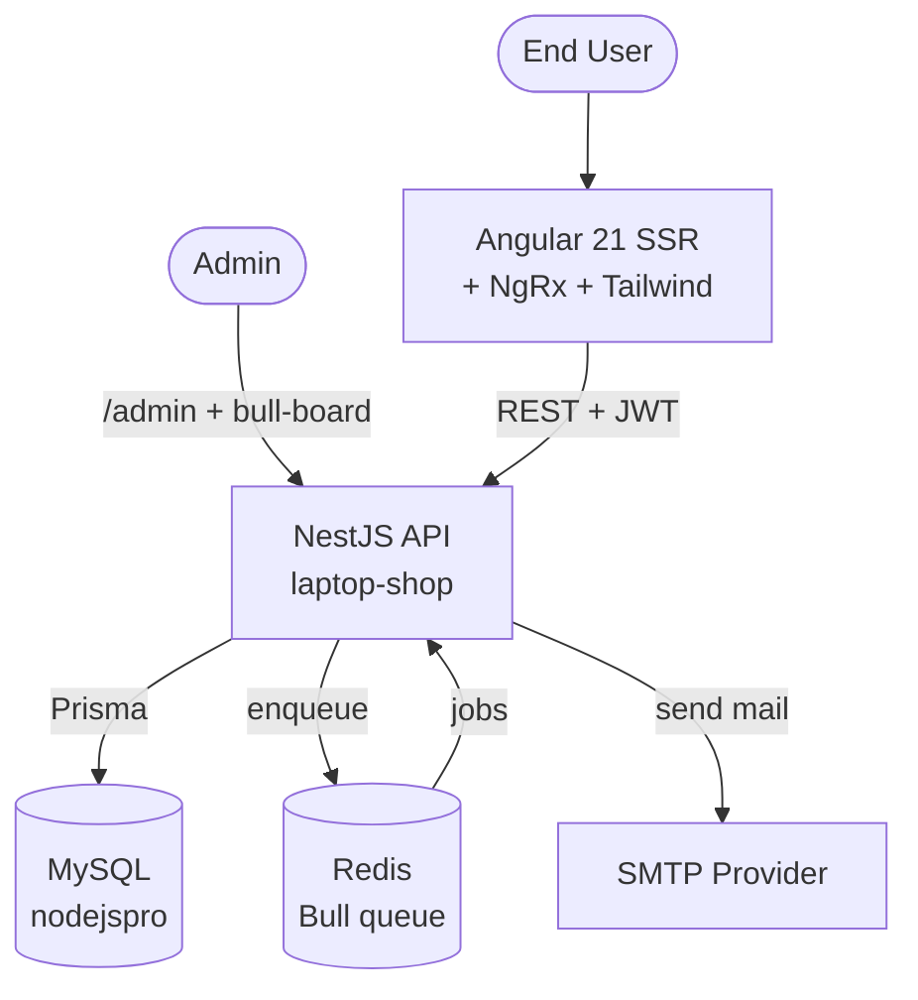

# System Overview — laptop-shop

Dự án thương mại điện tử laptop. Backend NestJS, frontend Angular 21 (SSR).

## Stack thực tế (từ `package.json`)

| Layer | Tech |
|-------|------|
| API server | **NestJS 9** + Express |
| ORM | **Prisma 6** |
| Database | **MySQL** (driver `mysql2`, DB `nodejspro`) |
| Auth | `@nestjs/jwt`, `@nestjs/passport` (passport-jwt + passport-local), `bcrypt` |
| Background jobs | **Bull / BullMQ** + Redis (`dump.rdb` ở repo root) |
| Job dashboard | `@bull-board/express` |
| Mail | `@nestjs-modules/mailer` + `nodemailer` + EJS templates |
| Scheduler | `@nestjs/schedule` (cronjob) |
| Validation | `class-validator`, `zod` |
| Events | `@nestjs/event-emitter` |
| Frontend | **Angular 21** + `@angular/ssr` |
| State (FE) | **NgRx Store 21** |
| Styling | **Tailwind CSS 4** |

## C4 — Context

## Module backend (`src/`)

| Module | Trách nhiệm |
|--------|-------------|
| `auth/` | Login local + JWT (access + refresh), guards, passport strategies |
| `users/` | CRUD user, role assignment |
| `roles/` | Quản lý role + permission (RBAC) |
| `products/` | CRUD sản phẩm laptop |
| `mail/` | Producer + processor cho email queue (Bull) |
| `cronjob/` | Job định kỳ + log vào `cronjob_logs` |
| `database/` | Wrapper `PrismaService` |
| `core/`, `common/`, `config/` | Filter, decorator, pipe, validator, env config |

## Module frontend (`angular-frontend/src/app/`)

| Phân vùng | Mô tả |
|-----------|-------|
| `client/auth/` | Đăng ký, đăng nhập, gọi `/auth/login|register|refresh` |
| `client/home/` | Trang chủ, danh sách sản phẩm |
| `client/product/` | Chi tiết sản phẩm |
| `client/cart/` | Giỏ hàng, gọi `/products/:id/add-to-cart`, … |
| `client/order/` + `order-history/` | Đặt hàng + lịch sử |
| `client/profile/` | Thông tin cá nhân |
| `admin/layout/` + `admin/dashboard/` | Khu vực admin |
| `shared/store/` | NgRx store (state toàn app) |
| `shared/services/` | HTTP clients gọi backend |
| `shared/guards/` | Route guard (auth, role) |
| `shared/interceptors/` | Gắn JWT, refresh token tự động |
| `shared/components/`, `shared/models/` | UI tái sử dụng + interface DTO |

## Thiết kế nổi bật
- **RBAC chi tiết**: bảng `permissions(resource, action)` + `role_permissions` → guard kiểm tra theo cặp (vd: `products.create`).
- **Refresh token** lưu trong cột `users.refresh_token` (xem `REFRESH-TOKEN-IMPLEMENTATION.md` ở source).
- **Email outbox kép**: Bull queue (Redis, nhanh) + bảng `email_queue` (MySQL, persistent retry).
- **Soft delete** mọi entity nghiệp vụ (`deleted_at`).

## Liên kết
- Flow email queue → [[Email_Queue_Flow]]
- API auth → [[Auth_API]]
- Schema MySQL → [[Schema_Design]]
- Conflict report → [[Conflict_Reports]]
