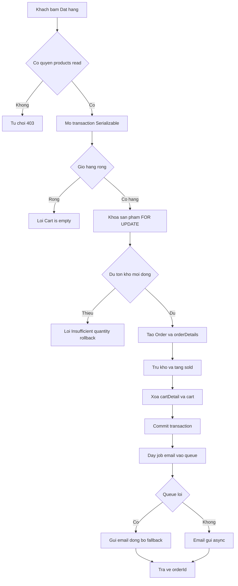

# Đặc tả Nghiệp vụ: Đặt hàng / Checkout

> ⚠️ **Chưa có PRD — suy luận từ code.** Thư mục `01_Raw/drive_docs/` rỗng, không có tài liệu sản phẩm gốc. Toàn bộ mục tiêu, actor và business rule dưới đây được suy luận và xác minh trực tiếp từ mã nguồn (`handlePlaceOrder` trong `products.service.ts`). Cần human review để bổ sung ý định nghiệp vụ thật sự.

## TL;DR

Luồng cho phép người dùng đã đăng nhập biến giỏ hàng hiện tại thành một đơn hàng. Hệ thống kiểm tra tồn kho trong một transaction có khóa hàng (row lock) để tránh bán quá số lượng, tạo đơn, trừ kho, xóa giỏ và gửi email xác nhận (qua hàng đợi, có fallback đồng bộ).

## Tổng quan & Mục tiêu

- Chuyển giỏ hàng của một user thành một đơn hàng (`Order`) duy nhất một cách an toàn về dữ liệu.
- Đảm bảo **không bán vượt tồn kho** ngay cả khi nhiều người mua cùng một sản phẩm đồng thời (chống race condition bằng `SELECT ... FOR UPDATE` + isolation level `Serializable`).
- Tự động trừ kho, tăng số đã bán, dọn sạch giỏ hàng và thông báo cho khách qua email.
- Đơn được tạo ở trạng thái "chưa chọn phương thức thanh toán" — thông tin người nhận và payment được điền ở bước sau (`updatePaymentMethod`).

## Tác nhân (Actors / Personas)

- **Khách hàng đã đăng nhập**: chủ thể chính, bấm "Đặt hàng" từ màn Giỏ hàng. Phải có quyền `products:read`.
- **Hệ thống đặt hàng (ProductsService)**: thực thi transaction, kiểm tra tồn kho, tạo đơn, trừ kho.
- **Hệ thống email (Email Queue + MailService)**: gửi email xác nhận đơn hàng bất đồng bộ; nếu queue lỗi thì gửi đồng bộ.

## Luồng xử lý chính (Happy Path)

1. Khách bấm "Đặt hàng" tại màn Giỏ hàng. FE gọi `POST /products/place-order` với `{ totalPrice }`.
2. Guard xác thực JWT + kiểm tra quyền `products:read` cho phép request đi qua.
3. Controller lấy `userId` từ token và gọi `handlePlaceOrder(userId, totalPrice)`.
4. Mở transaction (`Serializable`, timeout 10s). Lấy giỏ hàng của user kèm chi tiết và sản phẩm.
5. Nếu giỏ trống → ném lỗi "Cart is empty".
6. Khóa toàn bộ các bản ghi sản phẩm trong giỏ bằng `SELECT ... FOR UPDATE`.
7. Kiểm tra lại tồn kho từng dòng: nếu tồn kho < số lượng đặt → ném lỗi "Insufficient quantity".
8. Tạo `Order` mới với các `orderDetails`, `paymentMethod = NOT_DEFINED`, `paymentStatus = PAYMENT_UNPAID`, thông tin người nhận để rỗng.
9. Trừ tồn kho (`quantity decrement`) và tăng số đã bán (`sold increment`) cho từng sản phẩm.
10. Xóa toàn bộ `cartDetail` và `cart` của user.
11. Commit transaction → đơn hàng được tạo thành công.
12. Lấy email (username) của user. Đẩy job `order-confirmation` vào email queue (retry 3 lần, backoff exponential). Nếu queue lỗi → gửi email đồng bộ qua `MailService`; nếu email vẫn lỗi → bỏ qua, KHÔNG ảnh hưởng đơn.
13. Trả về `{ success: true, message, orderId }`.

## Ràng buộc nghiệp vụ (Business Rules)

| # | Quy tắc | Xác minh từ code |
|---|---------|------------------|
| BR1 | Chỉ user đã đăng nhập có quyền `products:read` mới được đặt hàng. | ✅ `products.controller.ts:119-121` (`@RequirePermissions(PERMISSIONS.PRODUCTS_READ)`) + `permissions.constant.ts:11` (`products:read`) |
| BR2 | Không cho đặt hàng khi giỏ trống hoặc không tồn tại. | ✅ `products.service.ts:252-254` (`if (!cart || cart.cartDetails.length === 0) throw 'Cart is empty'`) |
| BR3 | Toàn bộ thao tác đặt hàng chạy trong một transaction `Serializable`, timeout 10 giây — đảm bảo all-or-nothing. | ✅ `products.service.ts:237`, `344-347` (`isolationLevel: 'Serializable', timeout: 10000`) |
| BR4 | Khóa các bản ghi sản phẩm trong giỏ bằng `SELECT ... FOR UPDATE` trước khi kiểm tồn kho để chống race condition / oversell. | ✅ `products.service.ts:256-264` (`FOR UPDATE` raw query) |
| BR5 | Re-check tồn kho sau khi đã khóa: nếu `product.quantity < cartDetail.quantity` thì hủy đơn với lỗi "Insufficient quantity". | ✅ `products.service.ts:266-283` |
| BR6 | Đơn mới luôn được tạo với `paymentMethod = NOT_DEFINED`, `paymentStatus = PAYMENT_UNPAID`, thông tin người nhận để rỗng (điền ở bước chọn phương thức thanh toán sau). | ✅ `products.service.ts:286-303` (`paymentMethod: 'NOT_DEFINED'`, `paymentStatus: 'PAYMENT_UNPAID'`) |
| BR7 | Mỗi sản phẩm bị trừ tồn kho (`quantity -= qty`) và tăng số đã bán (`sold += qty`) trong cùng transaction. | ✅ `products.service.ts:313-328` |
| BR8 | Sau khi tạo đơn thành công, toàn bộ giỏ hàng (cartDetail + cart) của user bị xóa. | ✅ `products.service.ts:330-340` |
| BR9 | `totalPrice` được nhận từ FE và lưu trực tiếp vào đơn (không tính lại ở backend). | ⚠️ `products.controller.ts:121-124` + `products.service.ts:302` (`totalPrice: +totalPrice`) — backend tin tưởng giá trị client gửi, có rủi ro nghiệp vụ. |
| BR10 | Email xác nhận gửi qua queue với retry 3 lần (backoff exponential 2s); nếu queue lỗi thì gửi đồng bộ; nếu email lỗi thì bỏ qua, KHÔNG làm hỏng đơn. | ✅ `products.service.ts:360-424` (queue add `attempts: 3`, fallback `sendOrderConfirmationEmail`, catch nuốt lỗi email) |
| BR11 | Email người nhận chính là `username` của user (hệ thống dùng username như email). | ✅ `products.service.ts:351-358`, `366` (`email: user.username`) |

## Acceptance Criteria

- [ ] Đặt hàng khi giỏ trống → trả lỗi "Cart is empty", không tạo đơn.
- [ ] Đặt hàng khi một sản phẩm thiếu tồn kho → trả lỗi "Insufficient quantity", transaction rollback, kho không bị trừ.
- [ ] Đặt hàng thành công → tạo đúng 1 Order với đủ orderDetails, kho bị trừ, sold tăng, giỏ hàng bị xóa.
- [ ] Hai request đặt cùng sản phẩm cuối cùng đồng thời → chỉ một thành công, request còn lại nhận lỗi tồn kho (nhờ FOR UPDATE + Serializable).
- [ ] Đơn mới có `paymentMethod = NOT_DEFINED`, `paymentStatus = PAYMENT_UNPAID`.
- [ ] Email queue lỗi → vẫn gửi email đồng bộ; email lỗi hoàn toàn → đơn vẫn được tạo thành công.

## Xung đột PRD ↔ Code

Không có PRD để đối chiếu (`01_Raw/drive_docs/` rỗng) nên không xác định được xung đột chính thức.

**Điểm cần human review (rủi ro nghiệp vụ phát hiện từ code):**
- **BR9 — `totalPrice` không được backend tính lại.** Server lưu thẳng giá trị do client gửi (`products.service.ts:302`). Khách có thể chỉnh giá đơn. Nếu xác nhận đây là lỗi so với ý định nghiệp vụ → chạy `/log-conflict` để ghi nhận.

## Source of truth

- PRD: _(chưa có — `01_Raw/drive_docs/` rỗng)_
- Code: `/Users/nhatnguyen/Documents/Github/code-demo/laptop-shop/src/products/products.service.ts` (`handlePlaceOrder`, dòng 235-440)
- Code: `/Users/nhatnguyen/Documents/Github/code-demo/laptop-shop/src/products/products.controller.ts` (`placeOrder`, dòng 119-125)

## Liên kết

- [[04_API_Specs/FEA_004_San_Pham_Gio_Hang_Don_Hang|API Đơn hàng]] — đặc tả endpoint hiện thực luồng này.
- [[02_Design/SCR_003_Gio_Hang|Màn Giỏ hàng]] — màn hình khởi tạo đặt hàng.
- [[02_Design/SCR_006_Chi_Tiet_Don_Hang|Chi tiết đơn hàng]] — màn hình hiển thị đơn sau khi đặt.
- [[03_Architecture/laptop-shop_Architecture|Kiến trúc BE]] — kiến trúc backend laptop-shop.
