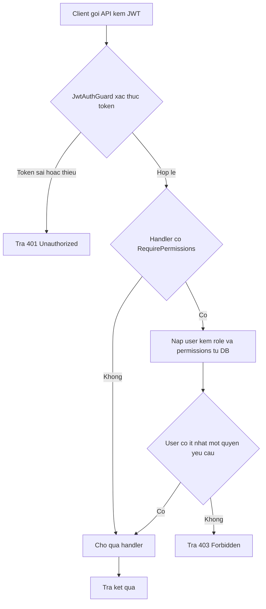

# Đặc tả Nghiệp vụ: Phân quyền RBAC (Role + Permission)

> ⚠️ Chưa có PRD — suy luận từ code. Thư mục `01_Raw/drive_docs/` rỗng, toàn bộ business rule dưới đây được dựng và xác minh trực tiếp từ mã nguồn backend `laptop-shop` (NestJS + Prisma).

## TL;DR

Luồng này kiểm soát truy cập tài nguyên của hệ thống laptop-shop theo mô hình RBAC: mỗi người dùng thuộc đúng **một vai trò (Role)**, mỗi vai trò gắn với một tập **quyền (Permission)** dạng `resource:action`. Endpoint khai báo quyền cần thiết qua decorator `@RequirePermissions`, và `PermissionGuard` chặn request nếu vai trò của user không có quyền tương ứng (trả 403).

## Tổng quan & Mục tiêu

Hệ thống có nhiều nhóm người dùng (admin, khách hàng, nhân viên bán hàng, kho, CSKH) cần mức truy cập khác nhau. Mục tiêu của RBAC:

- Tách bạch **xác thực** (bạn là ai — JWT) khỏi **phân quyền** (bạn được làm gì — Permission).
- Cho phép gán/thu hồi quyền theo vai trò mà không sửa code (sửa dữ liệu Role-Permission).
- Quản trị viên tự định nghĩa vai trò mới và gán quyền động qua API quản lý vai trò.

## Tác nhân (Actors / Personas)

- **Admin**: vai trò `ADMIN`, có toàn bộ quyền kể cả `admin:manage_roles`, `admin:manage_permissions`, `admin:view_system`. Là tác nhân duy nhất được tạo/sửa/xóa vai trò và gán lại quyền.
- **User / Khách hàng (CUSTOMER)**: chỉ có quyền đọc sản phẩm và tạo/đọc đơn của chính mình (`products:read`, `products:list`, `orders:create`, `orders:read`).
- **Nhân viên (STAFF_SALES / STAFF_WAREHOUSE / CUSTOMER_SUPPORT)**: các vai trò nghiệp vụ với tập quyền giới hạn theo chức năng (bán hàng, kho, chăm sóc khách hàng).
- **Hệ thống (cronjob)**: dùng nhóm quyền `system:*` cho tác vụ nền.

## Cơ chế RBAC

### Mô hình quyền `resource:action`

Mỗi permission được đặt tên theo định dạng `resource:action` (ví dụ `users:create`, `orders:cancel`, `admin:manage_roles`). Danh mục quyền khai báo tập trung tại `permissions.constant.ts:1-45`. Khi seed, chuỗi được tách thành cặp `resource` + `action` lưu vào bảng `permission` (`prisma/seed.ts:55-66`).

### Chuỗi guard (Guard chain)

Mỗi controller bảo vệ khai báo `@UseGuards(JwtAuthGuard, PermissionGuard)` — guard chạy tuần tự:

1. **JwtAuthGuard** (`jwt-auth.guard.ts:11`): bỏ qua nếu route `@Public`, ngược lại xác thực JWT và gắn `request.user`; thiếu/sai token → 401 (`jwt-auth.guard.ts:29-31`).
2. **PermissionGuard** (`permission.guard.ts:6`): đọc metadata `permissions` do `@RequirePermissions` đặt; nạp user kèm role + permissions từ DB; so khớp quyền yêu cầu với quyền của user.

### Luồng xử lý chính (Happy Path)

1. Client gọi API kèm Bearer JWT.
2. `JwtAuthGuard` xác thực token, gắn `request.user`.
3. `PermissionGuard.canActivate` đọc danh sách quyền yêu cầu của handler (`permission.guard.ts:10-13`).
4. Nếu handler không khai báo quyền → cho qua (`permission.guard.ts:15-17`).
5. Nạp `user` kèm `role.permissions.permission` từ DB (`permission.guard.ts:26-39`).
6. Trích danh sách tên quyền của user (`permission.guard.ts:46-48`).
7. Kiểm tra user có **ít nhất một** quyền trong danh sách yêu cầu (`permission.guard.ts:51-53`).
8. Đủ quyền → handler chạy; thiếu quyền → guard trả false → Nest trả **403 Forbidden**.

### Ánh xạ Role → Permission

Mapping mặc định khai báo tại `permissions.constant.ts:55-128` (`ROLE_PERMISSIONS`) và được nạp vào bảng `rolePermission` khi seed (`prisma/seed.ts:116-145`):

| Vai trò | Nhóm quyền chính |
|---------|------------------|
| `ADMIN` | Toàn bộ quyền (users, products, orders, inventory, reports, admin, system) |
| `CUSTOMER` | `products:read/list`, `orders:create/read` (chỉ đơn của mình) |
| `STAFF_SALES` | products read, orders create/read/update/process/list, users:read, reports:view |
| `STAFF_WAREHOUSE` | products read/update/list, orders read/update/list, inventory:* |
| `CUSTOMER_SUPPORT` | products read, orders read/update/list/cancel, users:read/update |

Admin có thể gán quyền động qua `PUT /roles/:id/permissions` → `RolesService.updateRolePermissions` (xóa toàn bộ quyền cũ rồi gán lại — `roles.service.ts:81-112`).

## Ràng buộc nghiệp vụ (Business Rules)

| # | Quy tắc | Xác minh từ code |
|---|---------|------------------|
| BR1 | Handler không khai báo `@RequirePermissions` thì mặc định mở (không bị PermissionGuard chặn). | ✅ `src/auth/guards/permission.guard.ts:15-17` |
| BR2 | User chỉ cần có **ÍT NHẤT MỘT** trong các quyền yêu cầu (logic OR, không phải AND). | ✅ `src/auth/guards/permission.guard.ts:51-53` |
| BR3 | Quyền được xác định qua chuỗi vai trò → permission của user, nạp trực tiếp từ DB mỗi request (không cache). | ✅ `src/auth/guards/permission.guard.ts:26-48` |
| BR4 | Thiếu quyền hoặc không tìm thấy user → guard trả false → 403 Forbidden. | ✅ `src/auth/guards/permission.guard.ts:21-23, 42-44, 51-53` |
| BR5 | Mọi thao tác tạo/sửa/xem/xóa vai trò yêu cầu quyền `admin:manage_roles`; gán lại quyền cho vai trò yêu cầu `admin:manage_permissions`. | ✅ `src/roles/roles.controller.ts:26,32,44,50,56,71` (manage_roles); `:38,62` (manage_permissions) |
| BR6 | Permission đặt tên theo định dạng `resource:action`; khi seed tách thành cặp resource + action. | ✅ `src/auth/constants/permissions.constant.ts:1-45`; `prisma/seed.ts:55-66` |
| BR7 | Không cho gán quyền không tồn tại cho vai trò → ném `NotFoundException` liệt kê quyền thiếu. | ✅ `src/roles/roles.service.ts:159-170` (assignPermissionsToRole) |
| BR8 | Cập nhật quyền của vai trò là thao tác thay thế toàn bộ: xóa hết quyền cũ rồi gán lại tập mới. | ✅ `src/roles/roles.service.ts:92-102` |
| BR9 | Không xóa được vai trò còn user đang gán → `ConflictException`. Xóa vai trò là soft-delete (`deletedAt`). | ✅ `src/roles/roles.service.ts:114-141` |
| BR10 | Tên vai trò là duy nhất; trùng tên khi tạo/sửa → `ConflictException` (Prisma P2002). | ✅ `src/roles/roles.service.ts:31-33, 107-109` |
| BR11 | Endpoint `GET /auth/permissions/my-permissions` không yêu cầu quyền — user nào đăng nhập cũng xem được quyền của chính mình. | ✅ `src/auth/controllers/permission.controller.ts:19-29` (không có `@RequirePermissions`) |

## Edge cases

- **Thiếu/hết hạn JWT**: `JwtAuthGuard.handleRequest` ném `UnauthorizedException` → **401** trước khi tới PermissionGuard (`jwt-auth.guard.ts:29-31`).
- **Có JWT nhưng thiếu quyền**: `PermissionGuard.canActivate` trả `false` → **403 Forbidden** (`permission.guard.ts:51-53`).
- **User trong token không còn trong DB**: `userWithPermissions` null → trả `false` → **403** (`permission.guard.ts:42-44`).
- **`request.user` rỗng** (guard chạy lệch thứ tự): trả `false` ngay (`permission.guard.ts:21-23`).
- **Gán quyền không tồn tại cho role**: `assignPermissionsToRole` ném `NotFoundException` với danh sách quyền thiếu (`roles.service.ts:159-170`).
- **Xóa role còn user**: chặn bằng `ConflictException`, không xóa (`roles.service.ts:122-127`).
- ⚠️ **Quyền cấp resource, không cấp record**: code đánh dấu `orders:read` của CUSTOMER là "chỉ đơn của mình" (`permissions.constant.ts:91`) nhưng PermissionGuard chỉ kiểm tra ở mức `resource:action`, KHÔNG kiểm tra quyền sở hữu record. Việc giới hạn "chỉ đơn của mình" phải do tầng service đảm nhiệm — cần human review để xác nhận đã hiện thực.

## Acceptance Criteria

- [ ] User không có quyền yêu cầu nhận đúng HTTP 403 khi gọi endpoint được bảo vệ.
- [ ] Request không có JWT hợp lệ nhận HTTP 401, không lọt vào PermissionGuard.
- [ ] Admin tạo vai trò mới và gán quyền qua `PUT /roles/:id/permissions` thành công; quyền có hiệu lực ngay ở request kế tiếp (không cache).
- [ ] Gán quyền không tồn tại cho vai trò trả lỗi rõ ràng liệt kê quyền thiếu.
- [ ] Không xóa được vai trò còn user đang sử dụng.
- [ ] Endpoint `my-permissions` trả về role + danh sách quyền của user hiện tại mà không cần quyền admin.

## Xung đột PRD ↔ Code

Không có PRD để đối chiếu (`drive_docs/` rỗng). Một điểm cần human review: ràng buộc "chỉ xem đơn của mình" của CUSTOMER được ghi chú trong constant nhưng KHÔNG được PermissionGuard thực thi ở mức record (xem Edge cases). Nếu xác nhận là lệch giữa kỳ vọng và hiện thực, đề xuất chạy `/log-conflict`.

## Source of truth

- PRD: _(không có — `01_Raw/drive_docs/` rỗng)_
- Code:
  - `/Users/nhatnguyen/Documents/Github/code-demo/laptop-shop/src/auth/guards/permission.guard.ts`
  - `/Users/nhatnguyen/Documents/Github/code-demo/laptop-shop/src/auth/constants/permissions.constant.ts`
  - `/Users/nhatnguyen/Documents/Github/code-demo/laptop-shop/src/roles/roles.controller.ts` + `roles.service.ts`
  - `/Users/nhatnguyen/Documents/Github/code-demo/laptop-shop/src/auth/controllers/permission.controller.ts`
  - `/Users/nhatnguyen/Documents/Github/code-demo/laptop-shop/prisma/seed.ts`

## Liên kết

- [[04_API_Specs/FEA_002_Phan_Quyen|API Phân quyền]]
- [[04_API_Specs/FEA_005_Quan_Ly_Vai_Tro|Quản lý vai trò]]
- [[04_API_Specs/FEA_006_Quan_Ly_Nguoi_Dung|Người dùng]]
- [[03_Architecture/laptop-shop_Architecture|Kiến trúc BE]]
