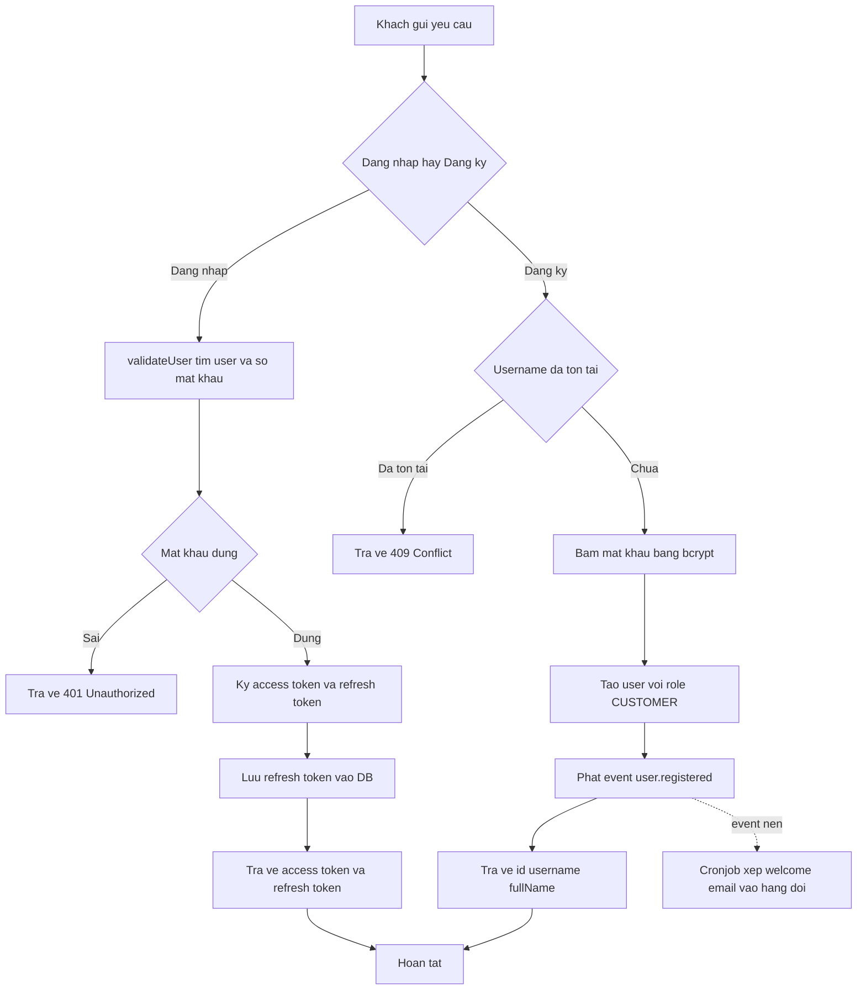

# Đặc tả Nghiệp vụ: Xác thực & Đăng ký

> ⚠️ **Chưa có PRD — suy luận từ code.** Thư mục `01_Raw/drive_docs/` rỗng nên toàn bộ nghiệp vụ dưới đây được tái dựng và xác minh trực tiếp từ source code `laptop-shop` qua CodeGraph MCP. Mọi business rule đều kèm `file:line`. Cần human review để đối chiếu với chủ đích sản phẩm thật.

## TL;DR

Luồng cho phép khách hàng tạo tài khoản mới và đăng nhập vào hệ thống laptop-shop bằng username/password, nhận về cặp JWT (access token + refresh token) để duy trì phiên. Phục vụ mọi người dùng cuối muốn mua hàng hoặc quản trị.

## Tổng quan & Mục tiêu

Hệ thống cần một cơ chế nhận diện và duy trì danh tính người dùng an toàn. Luồng Xác thực & Đăng ký cung cấp:

- **Đăng ký**: tạo tài khoản khách hàng mới, băm mật khẩu trước khi lưu, phát sự kiện gửi email chào mừng (bất đồng bộ).
- **Đăng nhập**: xác thực username/password và cấp phát cặp token.
- **Làm mới phiên**: cấp access token mới bằng refresh token mà không bắt đăng nhập lại.
- **Đăng xuất**: vô hiệu hóa phiên bằng cách xóa refresh token khỏi DB.

Toàn bộ logic nghiệp vụ nằm ở `AuthService` (`src/auth/auth.service.ts:10`); controller chỉ là lớp mỏng forward request.

## Tác nhân (Actors / Personas)

- **Khách (Guest / chưa đăng nhập)**: gọi đăng ký để tạo tài khoản, gọi đăng nhập để vào hệ thống. Mục tiêu: có một danh tính hợp lệ.
- **Người dùng đã đăng nhập (Customer)**: giữ access token, gọi làm mới khi token hết hạn, gọi đăng xuất khi rời hệ thống.
- **Hệ thống Cronjob/Email (Actor nội bộ)**: lắng nghe event `user.registered` để xếp welcome email vào hàng đợi (xử lý nền, không chặn response đăng ký).

## Luồng xử lý chính (Happy Path)

### Đăng nhập

1. Khách gửi `POST /auth/login` với `{ username, password }`.
2. `LocalAuthGuard` kích hoạt `LocalStrategy.validate` (`local.strategy.ts:12`).
3. `validateUser` tìm user theo username, so khớp mật khẩu bằng bcrypt `comparePassword` (`auth.service.ts:18-26`).
4. Nếu hợp lệ, loại bỏ field `password` rồi vào handler `login`.
5. `login` ký 2 token (access + refresh), lưu refresh token vào DB (`auth.service.ts:28-46`).
6. Trả về `{ access_token, refresh_token }`.

### Đăng ký

1. Khách gửi `POST /auth/register` với `{ username, password, fullName, ... }`.
2. `register` rút gọn field cần thiết rồi gọi `UsersService.create` (`auth.service.ts:48-56`).
3. `create` kiểm tra trùng username, băm mật khẩu, gán role CUSTOMER, lưu user (`users.service.ts:16-50`).
4. `register` phát event `user.registered` để gửi welcome email (`auth.service.ts:59-64`).
5. Trả về `{ id, username, fullName }`.

## Ràng buộc nghiệp vụ (Business Rules)

| # | Quy tắc | Xác minh từ code |
|---|---------|------------------|
| BR1 | Username phải duy nhất; trùng username khi đăng ký bị từ chối với `ConflictException`. | ✅ `users.service.ts:18-24` |
| BR2 | Mật khẩu KHÔNG bao giờ lưu dạng plaintext — luôn băm bằng bcrypt (saltRounds=10) trước khi lưu DB. | ✅ `users.service.ts:27` → `password.util.ts:9-14` |
| BR3 | Xác thực đăng nhập so khớp mật khẩu bằng `bcrypt.compare`; sai → trả `null` → `UnauthorizedException`. | ✅ `auth.service.ts:20-25`, `local.strategy.ts:14-16`, `password.util.ts:22-27` |
| BR4 | Mỗi phiên cấp cặp token: access token (mặc định `15m`) và refresh token (mặc định `7d`), cấu hình qua env. | ✅ `auth.service.ts:31-37` |
| BR5 | Refresh token được lưu vào DB mỗi lần login/refresh; được dùng để đối chiếu khi làm mới và xóa khi đăng xuất. | ✅ `auth.service.ts:40, 101, 114` → `users.service.ts:updateRefreshToken` |
| BR6 | Làm mới token hợp lệ khi: chữ ký JWT đúng VÀ refresh token khớp bản trong DB VÀ `user.id === payload.sub`; mọi lỗi → `UnauthorizedException('Invalid refresh token')`. | ✅ `auth.service.ts:78-85, 108` |
| BR7 | Đăng xuất set refresh token trong DB về `null`, vô hiệu hóa khả năng làm mới phiên. | ✅ `auth.service.ts:112-115` |
| BR8 | Object trả về sau xác thực KHÔNG chứa field `password` (bị loại bằng destructuring). | ✅ `auth.service.ts:21-23` |
| BR9 | User tạo qua đăng ký mặc định `accountType = SYSTEM` và gán role `CUSTOMER` (fallback `roleId = 1`). | ✅ `users.service.ts:28-30, 40-41` |
| BR10 | Đăng ký phát event `user.registered` (bất đồng bộ, không chặn response) để xếp welcome email vào hàng đợi. | ✅ `auth.service.ts:59-64` |
| BR11 | Ràng buộc DTO đăng ký: username 3-50 ký tự, password 6-100 ký tự (class-validator). | ✅ `users/dto/user.dto.ts:14-22` |

## Edge cases

| Tình huống | Hành vi hệ thống | Vị trí |
|------------|------------------|--------|
| Sai mật khẩu khi đăng nhập | `validateUser` trả `null` → `LocalStrategy` ném `UnauthorizedException` (401). | `auth.service.ts:25`, `local.strategy.ts:14-16` |
| Username không tồn tại khi đăng nhập | `findByUsername` trả `null` → cùng nhánh 401 như sai mật khẩu (không lộ user có tồn tại hay không). | `auth.service.ts:19-20`, `users.service.ts:102-113` |
| Đăng ký trùng username | `ConflictException('Username already exists')` (409). | `users.service.ts:22-24` |
| Refresh token hết hạn / sai chữ ký | `jwtService.verify` ném lỗi → catch → `UnauthorizedException('Invalid refresh token')`. | `auth.service.ts:78, 107-109` |
| Refresh token đúng chữ ký nhưng không khớp DB (vd đã logout) | `findByRefreshToken` trả `null` → `UnauthorizedException('Invalid refresh token')`. | `auth.service.ts:81-85` |
| Refresh token thiếu trong payload | DTO `@IsNotEmpty` chặn ở tầng validation. | `dto/refresh-token.dto.ts:4-6` |
| Đăng xuất khi đã đăng xuất | `updateRefreshToken(userId, null)` idempotent — vẫn trả `Logout successful`. | `auth.service.ts:112-115` |

## Acceptance Criteria

- [ ] Đăng ký với username mới + mật khẩu hợp lệ tạo được tài khoản, mật khẩu lưu DB ở dạng băm.
- [ ] Đăng ký trùng username trả lỗi 409.
- [ ] Đăng nhập đúng trả về `access_token` + `refresh_token`; refresh token được lưu DB.
- [ ] Đăng nhập sai mật khẩu/sai username trả 401, không lộ thông tin user tồn tại.
- [ ] Refresh token hợp lệ trả cặp token mới; token hết hạn/đã logout trả 401.
- [ ] Đăng xuất xóa refresh token khỏi DB, sau đó refresh bằng token cũ thất bại.
- [ ] Response xác thực không bao giờ chứa field `password`.

## Xung đột PRD ↔ Code

Không có PRD để đối chiếu (`01_Raw/drive_docs/` rỗng). Không phát hiện xung đột nội tại trong code. Khi có PRD, cần rà soát lại các điểm: chính sách hết hạn token, độ phức tạp mật khẩu, và `accountType` mặc định (`SYSTEM`) có khớp ý đồ sản phẩm không.

## Cần human review

- Thiếu PRD nguồn — toàn bộ mục tiêu sản phẩm là suy luận từ code.
- DTO `login` không có class-validator riêng (validate trong Passport local strategy) — cần xác nhận quy tắc username/password mong muốn.
- `refreshToken` dùng `JwtService.verify` với secret mặc định — cần kiểm tra có dùng secret riêng cho refresh token không.

## Source of truth

- PRD: _(không có — `01_Raw/drive_docs/` rỗng)_
- Code: `/Users/nhatnguyen/Documents/Github/code-demo/laptop-shop/src/auth/auth.service.ts`

## Liên kết

- [[04_API_Specs/FEA_001_Xac_Thuc|API Xác thực]]
- [[04_API_Specs/FEA_002_Phan_Quyen|Phân quyền]]
- [[02_Design/SCR_002_Dang_Nhap|Màn Đăng nhập]]
- [[03_Architecture/laptop-shop_Architecture|Kiến trúc BE]]
