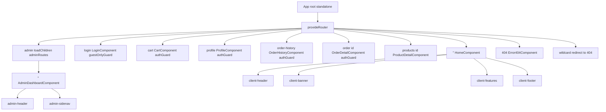
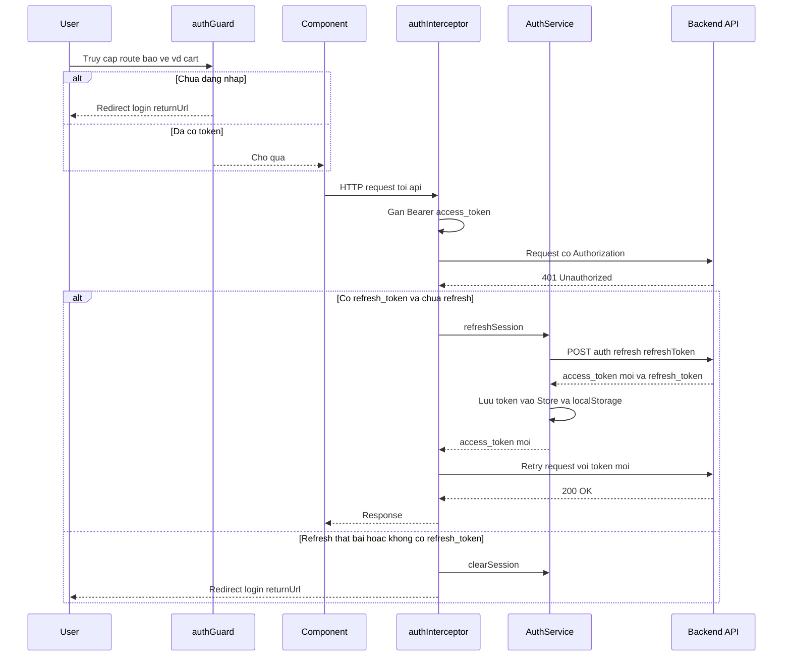
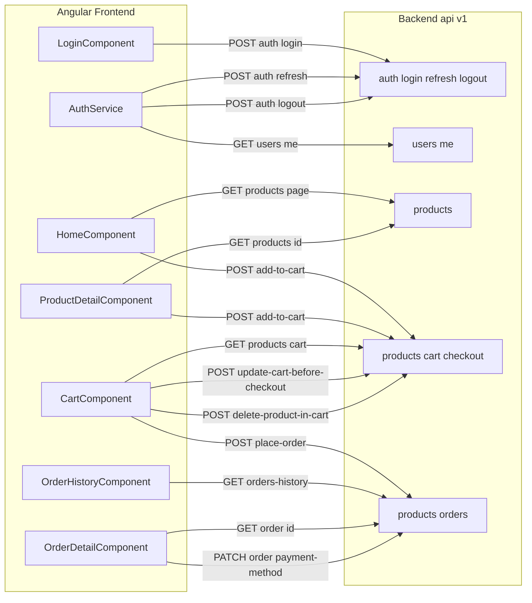

# Kiến trúc Frontend: laptop-shop-angular

## TL;DR
Frontend SPA bằng **Angular standalone** (không NgModule), bootstrap qua `ApplicationConfig` (`app.config.ts:11-21`). Mọi route đều **lazy** bằng `loadComponent` (client/error) hoặc `loadChildren` (admin). State xác thực quản lý bằng **NgRx Store** (`@ngrx/store`); phiên đăng nhập dựa trên **JWT access/refresh token** lưu trong `localStorage`. Bảo vệ route bằng `authGuard`/`guestOnlyGuard` cộng một **HTTP interceptor có cơ chế refresh-token tự động** (`auth.interceptor.ts`). Có cấu hình **SSR + Hydration** (`provideClientHydration(withEventReplay())`, `app.config.server.ts`). Mỗi component tự gọi `HttpClient` tới base URL `http://localhost:8080/api/v1/...` (hardcode, không có `src/environments/`).

> ⚠️ Cần human review: base URL `http://localhost:8080/api/v1` hardcode rải rác (`auth.service.ts:57-58`, `home.component.ts`, `cart.component.ts`, `product-detail.component.ts`, `order-detail.component.ts`, `order-history.component.ts`). Không có thư mục `src/environments/`. Route `admin` **không gắn guard** (`app.routes.ts:57-60`).

---

## 1. Tổng quan kiến trúc Angular

| Đặc điểm | Hiện trạng | Nguồn |
|----------|-----------|-------|
| Standalone components | `App` root standalone, không NgModule | `app.ts:4-12` |
| Bootstrap config | `ApplicationConfig` với mảng `providers` | `app.config.ts:11-21` |
| Router | `provideRouter(routes)` | `app.config.ts:14` |
| HTTP | `provideHttpClient(withFetch(), withInterceptors([authInterceptor]))` | `app.config.ts:16` |
| State management | `provideStore({ [authFeatureKey]: authReducer })` (NgRx) | `app.config.ts:17-19` |
| SSR / Hydration | `provideClientHydration(withEventReplay())` + server config | `app.config.ts:15`, `app.config.server.ts` |
| Lazy `loadComponent` | client + error routes | `app.routes.ts:9-66` |
| Lazy `loadChildren` | khu vực admin | `app.routes.ts:57-60`, `admin.routes.ts` |

**Phân tầng:** Component (UI + gọi API trực tiếp qua `HttpClient`) → `AuthService` (token/session) → NgRx Store (feature `auth`) → `localStorage`. Không có tầng repository/data-service riêng cho products/cart/order — mỗi component tự gọi `HttpClient`.

### Bảng route (client)

| Path | Component (lazy) | Guard | Nguồn |
|------|------------------|-------|-------|
| `''` | `HomeComponent` | — | `app.routes.ts:7-10` |
| `login` | `LoginComponent` | `guestOnlyGuard` | `app.routes.ts:11-15` |
| `cart` | `CartComponent` | `authGuard` | `app.routes.ts:16-20` |
| `profile` | `ProfileComponent` | `authGuard` | `app.routes.ts:21-25` |
| `order-history` | `OrderHistoryComponent` | `authGuard` | `app.routes.ts:26-31` |
| `order/:id` | `OrderDetailComponent` | `authGuard` | `app.routes.ts:32-36` |
| `products/:id` | `ProductDetailComponent` | — | `app.routes.ts:37-41` |
| `admin` | `adminRoutes` (loadChildren) | — ⚠️ | `app.routes.ts:57-60` |
| `404` | `Error404Component` | — | `app.routes.ts:63-66` |
| `**` | redirect `/404` | — | `app.routes.ts:77-80` |

### Liên kết màn hình (screens)
- `''` → [[02_Design/SCR_001_Trang_Chu|Trang chủ]]
- `login` → [[02_Design/SCR_002_Dang_Nhap|Đăng nhập]]
- `cart` → [[02_Design/SCR_003_Gio_Hang|Giỏ hàng]]
- `order-history` → [[02_Design/SCR_005_Lich_Su_Don_Hang|Lịch sử đơn hàng]]
- `products/:id` → [[02_Design/SCR_007_Chi_Tiet_San_Pham|Chi tiết sản phẩm]]
- `admin` → [[02_Design/SCR_009_Bang_Dieu_Khien_Admin|Admin]]

---

## 2. Sơ đồ cây Route + Component

> Lưu ý: các route bị comment trong code (`register`, `products` list, admin `users`/`products`/`orders`, `403`/`500`) chưa active nên không đưa vào sơ đồ (`app.routes.ts:42-74`, `admin.routes.ts`).

---

## 3. Luồng xác thực (Guard + Interceptor + Refresh Token)

**Thành phần:**
- `authGuard` — cho qua nếu `isAuthenticated()` hoặc có `access_token` trong `localStorage`; ngược lại `createUrlTree(['/login'], { returnUrl })` (`auth.guard.ts:5-21`).
- `guestOnlyGuard` — chặn `/login` khi đã đăng nhập, redirect `/` (`guest-only.guard.ts:5-17`).
- `authInterceptor` — gắn `Authorization: Bearer <token>` cho request tới `/api/`, bỏ qua `/auth/login` & `/auth/refresh`; bắt 401 → tự refresh, hàng đợi request đang chờ qua `BehaviorSubject` để tránh refresh song song (`auth.interceptor.ts:7-96`).
- `AuthService.refreshSession()` — gọi `POST /auth/refresh`, thành công → `setSessionFromTokens()`, thất bại → `clearSession()` (`auth.service.ts:155-181`).

**Luồng đăng nhập (login):** `LoginComponent.onSubmit()` → `POST /auth/login` → `AuthService.setSessionFromTokens()` (lưu Store + localStorage) → `fetchCurrentUser()` (`GET /users/me`) → điều hướng `returnUrl` (`login.component.ts:235-304`, `auth.service.ts:70-130`). Đặc tả backend: [[04_API_Specs/FEA_001_Xac_Thuc|Xác thực BE]].

---

## 4. Sơ đồ gọi API FE → BE

Base URL: `http://localhost:8080/api/v1`. Token đính kèm tự động bởi `authInterceptor` (trừ login/refresh).

### Bảng endpoint (bằng chứng file:line)

| Method | Endpoint | Gọi từ | Nguồn |
|--------|----------|--------|-------|
| POST | `/auth/login` | LoginComponent | `login.component.ts:209,293` |
| POST | `/auth/refresh` | AuthService.refreshSession | `auth.service.ts:165` |
| POST | `/auth/logout` | AuthService.logout | `auth.service.ts:184` |
| GET | `/users/me` | AuthService.fetchCurrentUser | `auth.service.ts:108` |
| GET | `/products?page=n` | HomeComponent | `home.component.ts:584` |
| POST | `/products/:id/add-to-cart` | Home / ProductDetail | `home.component.ts:625`, `product-detail.component.ts:368` |
| GET | `/products/:id` | ProductDetailComponent | `product-detail.component.ts:323` |
| GET | `/products/cart` | CartComponent | `cart.component.ts:515` |
| POST | `/products/update-cart-before-checkout` | CartComponent | `cart.component.ts:668,721` |
| POST | `/products/delete-product-in-cart/:id` | CartComponent | `cart.component.ts:693` |
| POST | `/products/place-order` | CartComponent | `cart.component.ts:609-611` |
| GET | `/products/orders-history` | OrderHistoryComponent | `order-history.component.ts:384` |
| GET | `/products/order/:id` | OrderDetailComponent | `order-detail.component.ts:551` |
| PATCH | `/products/order/:id/payment-method` | OrderDetailComponent | `order-detail.component.ts:486` |

> Lưu ý kiến trúc: mọi thao tác cart/order đều đi qua prefix `/products/...` (kể cả `orders-history`, `place-order`, `order/:id`) — đây là quy ước backend, không phải tài nguyên `products` thuần.

---

## 5. State (NgRx) & lưu trữ phiên

| Thành phần | Vai trò | Nguồn |
|------------|---------|-------|
| `authReducer` / `authFeatureKey` | Feature state `auth` | `app.config.ts:9,17-19`, `shared/store/auth/auth.reducer.ts` |
| `AuthActions` | setTokens, setCurrentUser, hydrateSession, clearSession, cart count | `shared/store/auth/auth.actions.ts` |
| Selectors | `selectCurrentUser`, `selectAccessToken`, `selectRefreshToken`, `selectTotalItemsInCart` | `shared/store/auth/auth.selectors.ts` |
| `AuthService` signals | `toSignal()` bọc selectors; `isAuthenticated` computed | `auth.service.ts:60-64` |
| `localStorage` | `access_token`, `refresh_token`, `user`, `total_items_in_cart` (đồng bộ 2 chiều) | `auth.service.ts:81-96,191-251` |

`AuthService` constructor gọi `restoreSession()` để hydrate Store từ `localStorage` khi khởi động (`auth.service.ts:66-68,202`).

> Không phát hiện queue/cronjob trong codebase (frontend Angular thuần).

---

## 6. Bản đồ phụ thuộc (từ CodeGraph)

CodeGraph parse được rõ tầng infrastructure (guard / interceptor / service / store) vì đây là TypeScript thuần, không phụ thuộc template. Dưới đây là quan hệ gọi do CodeGraph phát hiện trực tiếp:

| Thành phần | Phụ thuộc (callees thực CodeGraph thấy) | Nguồn |
|------------|------------------------------------------|-------|
| `authInterceptor` | `AuthService.accessToken`, `AuthService.refreshToken`, `AuthService.refreshSession`, `AuthService.clearSession`, các helper `isApiRequest` / `isAuthLoginOrRefresh` / `addAuthHeader` | `auth.interceptor.ts:10-23` |
| `AuthService.refreshSession` | `refreshToken`, `setSessionFromTokens`, `clearSession` | `auth.service.ts:155-181` |
| `authGuard` / `guestOnlyGuard` | `AuthService.isAuthenticated` | `auth.guard.ts:5`, `guest-only.guard.ts:5` |

**Impact của `AuthService` (CodeGraph `impact`, depth 2): 47 symbol** trải khắp interceptor, cả hai guard, `client-header` (`onLogout`, `displayUser`, `displayCartCount`) và 6 component nghiệp vụ — `login.onSubmit`, `home.ngOnInit/addToCart`, `product-detail.addToCart`, `cart.loadCart/onPlaceOrder/deleteProductInCart`, `order-detail.confirmOrder`. → `AuthService` là điểm phụ thuộc trung tâm của toàn FE; mọi thay đổi chữ ký token/session đều lan ra các component này.

> Hạn chế CodeGraph với Angular: `codegraph_callees` ở **cấp class component thường rỗng** vì lời gọi API/HttpClient đi qua template-binding và RxJS, không phải call-edge tĩnh AST. Vì vậy phần map endpoint (mục 4) và cây component (mục 2) lấy bằng chứng từ **Read trực tiếp** tại `local_path` kèm `file:line`, không dựa vào callee graph. Tầng guard/interceptor/service (mục 6 này) thì CodeGraph cho kết quả đầy đủ và đáng tin.

Tham chiếu graph chi tiết: [[06_Code_Graph/laptop-shop-angular/README|Code Graph FE]].

---

## Source of truth
- Code: `/Users/nhatnguyen/Documents/Github/code-demo/laptop-shop-angular/src/app`
- Catalog: `01_Raw/codebase/projects.json#laptop-shop-angular`

## Liên kết
- [[Index]]
- [[04_API_Specs/FEA_001_Xac_Thuc|Xác thực BE]]
- [[06_Code_Graph/laptop-shop-angular/README|Code Graph FE]]
- [[02_Design/SCR_001_Trang_Chu|Trang chủ]]
- [[02_Design/SCR_002_Dang_Nhap|Đăng nhập]]
- [[02_Design/SCR_003_Gio_Hang|Giỏ hàng]]
- [[02_Design/SCR_005_Lich_Su_Don_Hang|Lịch sử đơn hàng]]
- [[02_Design/SCR_007_Chi_Tiet_San_Pham|Chi tiết sản phẩm]]
- [[02_Design/SCR_009_Bang_Dieu_Khien_Admin|Admin]]
