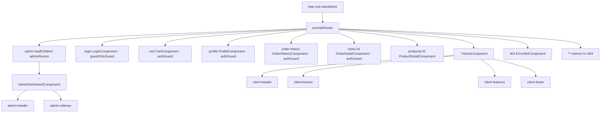
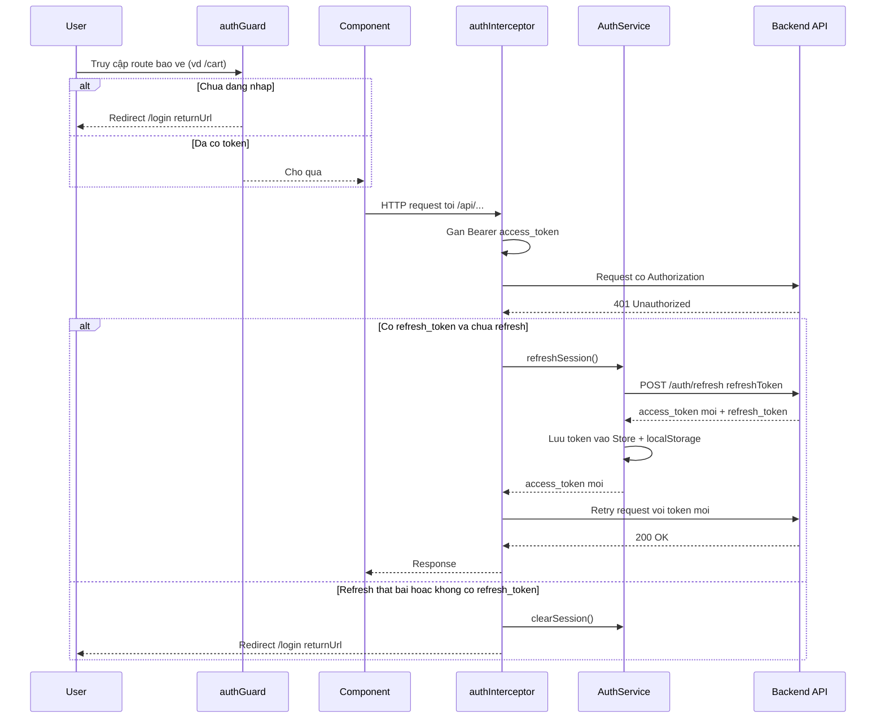
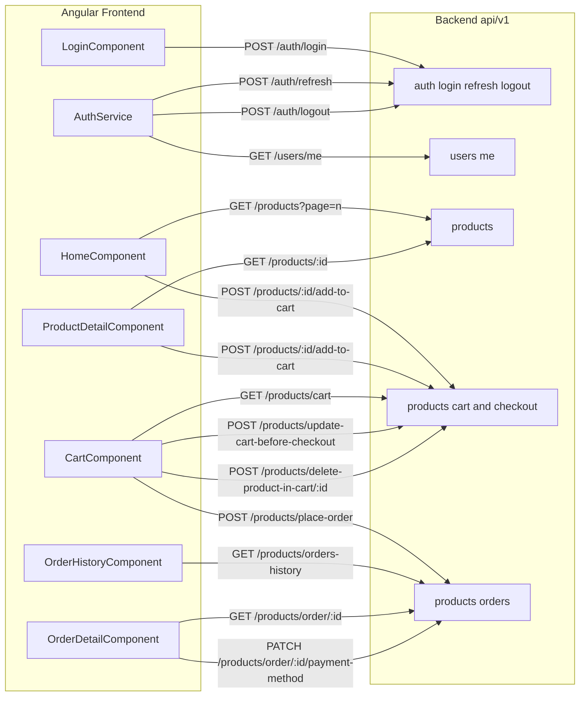

# Kiến trúc: laptop-shop-angular

## TL;DR
Frontend SPA bằng **Angular standalone** (không NgModule), bootstrap qua `ApplicationConfig`. Toàn bộ route dùng **lazy `loadComponent` / `loadChildren`**. State auth quản lý bằng **NgRx Store** (`@ngrx/store`), phiên đăng nhập dựa trên **JWT access/refresh token** lưu `localStorage`. Xác thực thực hiện qua `authGuard`/`guestOnlyGuard` + một **HTTP interceptor có refresh-token tự động**. Backend gọi trực tiếp tới `http://localhost:8080/api/v1/...` (base URL hardcode trong từng service/component — không có `environments/`).

> ⚠️ Cần human review: base URL `http://localhost:8080/api/v1` được hardcode rải rác trong nhiều file (`auth.service.ts:57-58`, `login.component.ts:209`, `home.component.ts:546`, `cart.component.ts:479`, `order-detail.component.ts:421`, `product-detail.component.ts:289,323`, `order-history.component.ts:342`). Không có thư mục `src/environments/`.

---

## 1. Tổng quan kiến trúc Angular

| Đặc điểm | Hiện trạng | Nguồn |
|----------|-----------|-------|
| Standalone components | Có — `App` root standalone, không NgModule | `app.ts:4-12` |
| Bootstrap config | `ApplicationConfig` với providers | `app.config.ts:11-21` |
| Router | `provideRouter(routes)` | `app.config.ts:14` |
| HTTP | `provideHttpClient(withFetch(), withInterceptors([authInterceptor]))` | `app.config.ts:16` |
| State management | `provideStore({ [authFeatureKey]: authReducer })` (NgRx) | `app.config.ts:17-19` |
| SSR / Hydration | `provideClientHydration(withEventReplay())` | `app.config.ts:15` |
| Lazy loading | `loadComponent` cho client/error; `loadChildren` cho admin | `app.routes.ts:9-66` |

**Phân tầng:** Component (UI + gọi API trực tiếp qua `HttpClient`) → `AuthService` (session/token) → NgRx Store (`auth` feature) → `localStorage`. Không có tầng repository/data-service riêng cho products/cart/order — mỗi component tự gọi `HttpClient`.

### Bảng route (client)

| Path | Component (lazy) | Guard | Nguồn |
|------|------------------|-------|-------|
| `''` | `HomeComponent` | — | `app.routes.ts:7-10` |
| `login` | `LoginComponent` | `guestOnlyGuard` | `app.routes.ts:11-15` |
| `cart` | `CartComponent` | `authGuard` | `app.routes.ts:16-20` |
| `profile` | `ProfileComponent` | `authGuard` | `app.routes.ts:21-25` |
| `order-history` | `OrderHistoryComponent` | `authGuard` | `app.routes.ts:26-31` |
| `order/:id` | `OrderDetailComponent` | `authGuard` | `app.routes.ts:32-36` |
| `products/:id` | `ProductDetailComponent` | — | `app.routes.ts:37-41` |
| `admin` | `adminRoutes` (loadChildren) | — | `app.routes.ts:57-60` |
| `404` | `Error404Component` | — | `app.routes.ts:63-66` |
| `**` | redirect `/404` | — | `app.routes.ts:77-80` |

### Bảng route (admin — lazy children)

| Path | Component (lazy) | Nguồn |
|------|------------------|-------|
| `admin/''` | `AdminDashboardComponent` | `admin.routes.ts:4-8` |

> ⚠️ Cần human review: route `admin` **không** gắn guard nào (`app.routes.ts:57-60`) → khu vực admin hiện chưa được bảo vệ bởi `authGuard`/role guard.

### Liên kết màn hình (screens)
- `''` → [[02_Design/SCR_001_Trang_Chu|Trang chủ]]
- `login` → [[02_Design/SCR_002_Dang_Nhap|Đăng nhập]]
- `cart` → [[02_Design/SCR_003_Gio_Hang|Giỏ hàng]]
- `profile` → [[02_Design/SCR_004_Ho_So_Ca_Nhan|Hồ sơ]]
- `order-history` → [[02_Design/SCR_005_Lich_Su_Don_Hang|Lịch sử đơn hàng]]
- `order/:id` → [[02_Design/SCR_006_Chi_Tiet_Don_Hang|Chi tiết đơn hàng]]
- `products/:id` → [[02_Design/SCR_007_Chi_Tiet_San_Pham|Chi tiết sản phẩm]]
- `admin` → [[02_Design/SCR_009_Bang_Dieu_Khien_Admin|Admin]]

---

## 2. Sơ đồ cây Route + Component

> Lưu ý: các route bị comment trong code (`register`, `products` list, admin `users`/`products`/`orders`, `403`/`500`) **chưa active** nên không đưa vào sơ đồ (`app.routes.ts:42-74`, `admin.routes.ts:9-20`).

---

## 3. Luồng xác thực (Guard + Interceptor + Refresh Token)

**Thành phần:**
- `authGuard` — chặn route cần đăng nhập; cho qua nếu `isAuthenticated()` hoặc có `access_token` trong `localStorage`, ngược lại redirect `/login?returnUrl=...` (`auth.guard.ts:5-21`).
- `guestOnlyGuard` — chặn `/login` khi đã đăng nhập, redirect `/` (`guest-only.guard.ts:5-17`).
- `authInterceptor` — gắn `Authorization: Bearer <token>` cho request tới `/api/`, bỏ qua `/auth/login` & `/auth/refresh`; bắt 401 → tự refresh token, hàng đợi request đang chờ qua `BehaviorSubject` để tránh refresh song song (`auth.interceptor.ts:7-96`).
- `AuthService.refreshSession()` — gọi `POST /auth/refresh`, lưu token mới; thất bại → `clearSession()` (`auth.service.ts:155-181`).

**Luồng đăng nhập (login):** `LoginComponent.onSubmit()` → `POST /auth/login` → `AuthService.setSessionFromTokens()` (lưu Store + localStorage) → `fetchCurrentUser()` (`GET /users/me`) → điều hướng `returnUrl` (`login.component.ts:235-304`, `auth.service.ts:70-130`). Liên kết đặc tả backend: [[04_API_Specs/FEA_001_Xac_Thuc|Xác thực BE]].

---

## 4. Sơ đồ gọi API FE → BE

Base URL: `http://localhost:8080/api/v1`. Token đính kèm tự động bởi `authInterceptor` (trừ login/refresh).

### Bảng endpoint (bằng chứng file:line)

| Method | Endpoint | Gọi từ | Nguồn |
|--------|----------|--------|-------|
| POST | `/auth/login` | LoginComponent | `login.component.ts:209,293` |
| POST | `/auth/refresh` | AuthService.refreshSession | `auth.service.ts:165` |
| POST | `/auth/logout` | AuthService.logout | `auth.service.ts:184` |
| GET | `/users/me` | AuthService.fetchCurrentUser | `auth.service.ts:108` |
| GET | `/products?page=n` | HomeComponent | `home.component.ts:584` |
| POST | `/products/:id/add-to-cart` | Home / ProductDetail | `home.component.ts:625`, `product-detail.component.ts:368` |
| GET | `/products/:id` | ProductDetailComponent | `product-detail.component.ts:323` |
| GET | `/products/cart` | CartComponent | `cart.component.ts:515` |
| POST | `/products/update-cart-before-checkout` | CartComponent | `cart.component.ts:668,721` |
| POST | `/products/delete-product-in-cart/:id` | CartComponent | `cart.component.ts:693` |
| POST | `/products/place-order` | CartComponent | `cart.component.ts:609-611` |
| GET | `/products/orders-history` | OrderHistoryComponent | `order-history.component.ts:384` |
| GET | `/products/order/:id` | OrderDetailComponent | `order-detail.component.ts:551` |
| PATCH | `/products/order/:id/payment-method` | OrderDetailComponent | `order-detail.component.ts:486` |

> Lưu ý kiến trúc: các thao tác cart/order đều đi qua prefix `/products/...` (kể cả `orders-history`, `place-order`, `order/:id`) — đây là quy ước của backend, không phải tài nguyên `products` thuần.

---

## 5. State (NgRx) & lưu trữ phiên

| Thành phần | Vai trò | Nguồn |
|------------|---------|-------|
| `authReducer` / `authFeatureKey` | Feature state `auth` | `app.config.ts:9,17-19`, `shared/store/auth/auth.reducer.ts` |
| `AuthActions` | setTokens, setCurrentUser, hydrateSession, clearSession, cart count | `shared/store/auth/auth.actions.ts` |
| Selectors | `selectCurrentUser`, `selectAccessToken`, `selectRefreshToken`, `selectTotalItemsInCart` | `shared/store/auth/auth.selectors.ts` |
| `AuthService` signals | `toSignal()` bọc selectors; `isAuthenticated` computed | `auth.service.ts:60-64` |
| `localStorage` | `access_token`, `refresh_token`, `user`, `total_items_in_cart` (đồng bộ 2 chiều) | `auth.service.ts:81-96,191-251` |

`AuthService` constructor gọi `restoreSession()` để hydrate Store từ `localStorage` khi khởi động, sau đó `fetchCurrentUser()` (`auth.service.ts:66-68,202-251`).

> Không phát hiện queue/cronjob trong codebase (đây là frontend Angular thuần).

---

## Source of truth
- Code: `/Users/nhatnguyen/Documents/Github/code-demo/laptop-shop-angular`
- Catalog: `01_Raw/codebase/projects.json#laptop-shop-angular`

## Liên kết
- [[Index]]
- [[04_API_Specs/FEA_001_Xac_Thuc|Xác thực BE]]
- [[02_Design/SCR_002_Dang_Nhap|Đăng nhập]]
- [[02_Design/SCR_009_Bang_Dieu_Khien_Admin|Admin]]
