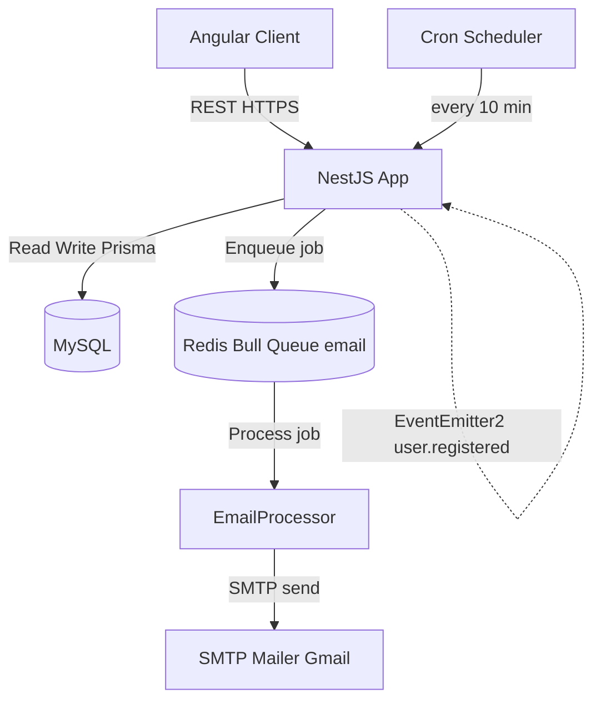
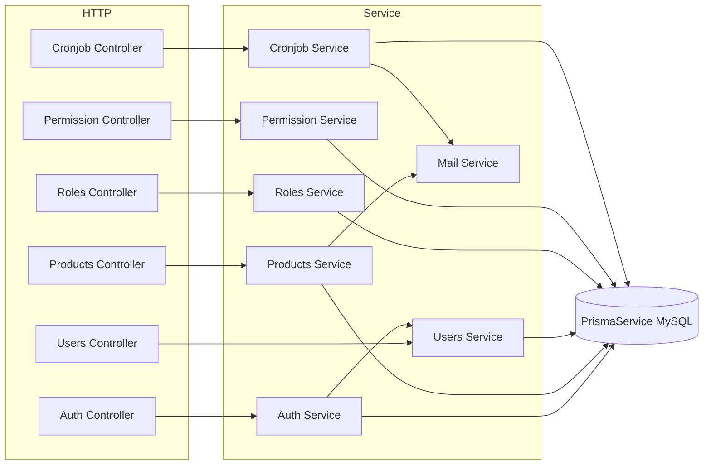
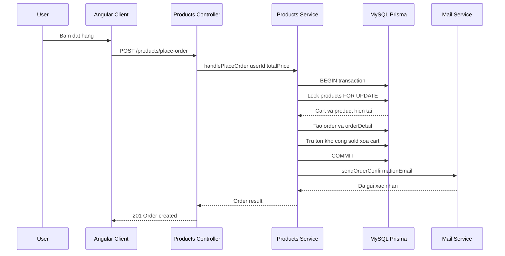
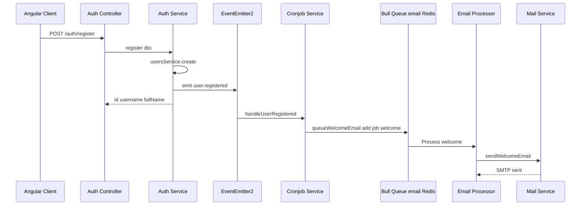
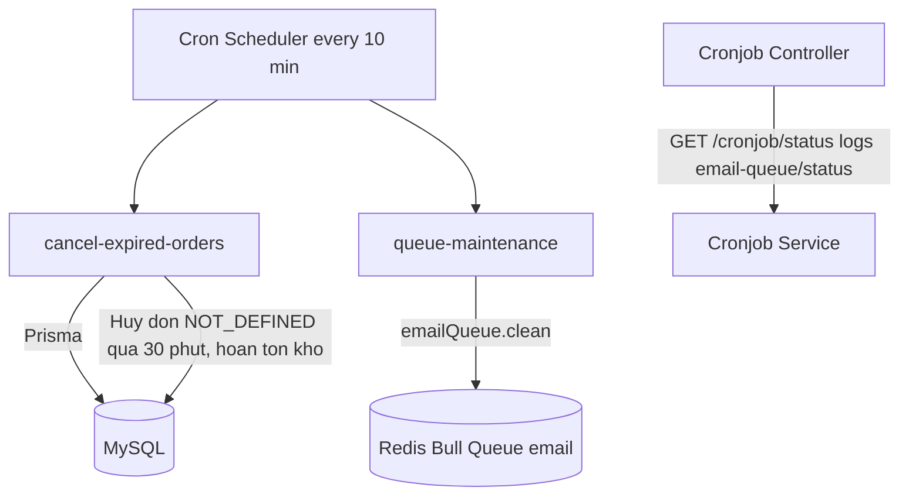

# Kiến trúc: laptop-shop (Backend)

## TL;DR

Backend NestJS theo kiến trúc module hóa (controller → service → Prisma). Dữ liệu lưu trên MySQL qua Prisma; xử lý phi đồng bộ email bằng **Bull queue** trên **Redis**; tác vụ định kỳ bằng `@Cron` (NestJS Schedule). Giao tiếp lỏng giữa Auth và Cronjob qua **EventEmitter2** (sự kiện `user.registered`). Tài liệu này được tái sinh bằng CodeGraph (mọi claim kèm `file:line`).

> Phạm vi: thư mục `src/` của project `laptop-shop`. Frontend Angular được mô tả riêng tại `laptop-shop-angular_Architecture.md`.

---

## 1. Sơ đồ tổng quan (C4 — Container Level)

**Bằng chứng hạ tầng (bootstrap tại `src/app.module.ts`):**

| Thành phần | Cấu hình | Nguồn |
|---|---|---|
| HTTP API | NestJS app, global `HttpExceptionFilter` | `src/app.module.ts:53` |
| EventEmitter | `EventEmitterModule.forRoot()` | `src/app.module.ts:24` |
| Bull + Redis | `BullModule.forRootAsync` đọc `REDIS_HOST/PORT/PASSWORD` | `src/app.module.ts:25` |
| MySQL | `DatabaseModule` + `PrismaService` | `src/app.module.ts:45`, `src/database/prisma.service.ts` |
| Queue `email` | `BullModule.registerQueue({ name: 'email' })` | `src/mail/mail.module.ts:10` |
| SMTP Mailer | `MailerModule.forRootAsync` (host/port/auth từ `MAIL_*`) | `src/mail/mail.module.ts:13` |
| Cron Scheduler | `@Cron` trong `CronjobService` (NestJS Schedule) | `src/cronjob/services/cronjob.service.ts:32` |

---

## 2. Phân tầng & Module

Mỗi feature là một NestJS module độc lập: `Controller` (HTTP + guard) → `Service` (business logic) → `PrismaService` (data access). DTO + validators ở tầng biên, guard/decorator dùng chung ở `common` và `auth`.

| Module/Area | Trách nhiệm | Nguồn | Spec |
|---|---|---|---|
| auth | Đăng ký, đăng nhập, JWT, refresh token, guard, passport | `src/auth` | [[04_API_Specs/FEA_001_Xac_Thuc|Xác thực]] |
| auth (permission/guard) | Phân quyền theo permission, `PermissionGuard`, `RoleGuard` | `src/auth/guards`, `src/auth/services/permission.service.ts` | [[04_API_Specs/FEA_002_Phan_Quyen|Phân quyền]] |
| roles | Quản lý vai trò, gán permission cho role | `src/roles` | [[04_API_Specs/FEA_005_Quan_Ly_Vai_Tro|Vai trò]] |
| users | Quản lý người dùng, đổi mật khẩu, refresh token store | `src/users` | [[04_API_Specs/FEA_006_Quan_Ly_Nguoi_Dung|Người dùng]] |
| products | Sản phẩm, giỏ hàng, đặt hàng, lịch sử đơn, payment method | `src/products` | [[04_API_Specs/FEA_004_San_Pham_Gio_Hang_Don_Hang|Đơn hàng]] |
| cronjob | Cron định kỳ + producer email queue + log job | `src/cronjob` | [[04_API_Specs/FEA_003_Cronjob_Hang_Doi_Email|Cronjob & Email]] |
| mail | Consumer queue email (`EmailProcessor`) + gửi SMTP | `src/mail` | [[04_API_Specs/FEA_003_Cronjob_Hang_Doi_Email|Cronjob & Email]] |
| common / core | Decorator, guard chung, filter, interceptor, util password | `src/common`, `src/core` | — |
| database | `PrismaService` kết nối MySQL | `src/database` | — |

---

## 3. Luồng giao dịch tiêu biểu — Đặt hàng (place-order)

Luồng được dựng từ `codegraph_trace`/`codegraph_callees`: `placeOrder` (controller) → `handlePlaceOrder` (service, chạy trong `prisma.$transaction`) → `sendOrderConfirmationEmail` (mail service). Service khóa hàng bằng `SELECT ... FOR UPDATE` để tránh race condition tồn kho.

**Bằng chứng:**
- `POST /products/place-order` → `placeOrder` — `src/products/products.controller.ts:119`
- `placeOrder` gọi `handlePlaceOrder` — `src/products/products.controller.ts:121`
- `handlePlaceOrder` mở `prisma.$transaction`, khóa `FOR UPDATE`, kiểm tra tồn kho — `src/products/products.service.ts:235`
- Callee `sendOrderConfirmationEmail` — `src/mail/services/mail.service.ts:109`

> Ghi chú: trong `handlePlaceOrder`, email xác nhận đơn được gọi **trực tiếp** qua `MailService` (gửi đồng bộ SMTP), không qua Bull queue — khác với welcome email.

---

## 4. Luồng Queue Email + Cronjob

### 4.1 Welcome email (register → event → queue → processor)

Đăng ký không gửi email trực tiếp: `AuthService.register` phát sự kiện `user.registered` qua `EventEmitter2`; `CronjobService.handleUserRegistered` lắng nghe và **enqueue** job `welcome` vào Bull queue `email`; `EmailProcessor` consume và gửi SMTP.

**Bằng chứng:**
- `POST /auth/register` → `handleRegister` → `register` — `src/auth/auth.controller.ts:29`, `src/auth/auth.service.ts:48`
- `eventEmitter.emit('user.registered', ...)` — `src/auth/auth.service.ts:59`
- `@OnEvent('user.registered') handleUserRegistered` → `queueWelcomeEmail` — `src/cronjob/services/cronjob.service.ts:23`
- Producer `queueWelcomeEmail` enqueue vào `@InjectQueue('email')` — `src/cronjob/services/cronjob.service.ts:156`, `src/cronjob/services/cronjob.service.ts:18`
- Consumer `@Process('welcome') handleWelcomeEmail` → `sendWelcomeEmail` — `src/mail/processors/email.processor.ts:26`, `src/mail/services/mail.service.ts:50`

### 4.2 Cronjob định kỳ

`CronjobService` đăng ký các job bằng `@Cron(CronExpression.EVERY_10_MINUTES)`. Trạng thái/log job đọc qua `CronjobController` (yêu cầu permission `SYSTEM:READ`).

| Job (name) | Lịch | Tác vụ | Nguồn |
|---|---|---|---|
| `cancel-expired-orders` | mỗi 10 phút | Hủy order `PENDING` + `NOT_DEFINED` quá 30 phút, hoàn lại `quantity`/`sold` cho product | `src/cronjob/services/cronjob.service.ts:32` |
| `queue-maintenance` | mỗi 10 phút | Dọn job `completed` cũ hơn 1 ngày trong queue `email`, giám sát queue | `src/cronjob/services/cronjob.service.ts:115` |

| Queue | Job type | Producer | Consumer |
|---|---|---|---|
| `email` | `welcome` | `CronjobService.queueWelcomeEmail` (`cronjob.service.ts:156`) | `EmailProcessor.handleWelcomeEmail` (`email.processor.ts:26`) |
| `email` | `password-reset` | (producer trong cronjob service) | `EmailProcessor.handlePasswordResetEmail` (`email.processor.ts`) |
| `email` | `order-confirmation` | (producer trong cronjob service) | `EmailProcessor.handleOrderConfirmationEmail` (`email.processor.ts`) |

---

## 5. Bản đồ phụ thuộc (từ CodeGraph)

Các quan hệ caller → callee nổi bật mà CodeGraph phát hiện giữa các module:

| Caller | Callee | Ý nghĩa | Nguồn |
|---|---|---|---|
| `placeOrder` (products controller) | `handlePlaceOrder` (products service) | HTTP → business đặt hàng | `products.controller.ts:121` |
| `handlePlaceOrder` (products) | `sendOrderConfirmationEmail` (mail) | products → mail (gọi SMTP trực tiếp) | `products.service.ts:235` → `mail.service.ts:109` |
| `handleRegister` (auth controller) | `register` (auth service) | HTTP → đăng ký | `auth.controller.ts:29` |
| `register` (auth service) | `create` (users service) | auth → users (tạo user) | `auth.service.ts:56` |
| `register` (auth service) | `emit('user.registered')` (EventEmitter2) | auth → cronjob (gián tiếp qua event bus) | `auth.service.ts:59` |
| `handleUserRegistered` (cronjob) | `queueWelcomeEmail` (cronjob) | event listener → producer queue | `cronjob.service.ts:24` |
| `queueWelcomeEmail` (cronjob) | `emailQueue.add` (Bull/Redis) | producer enqueue job `welcome` | `cronjob.service.ts:156` |
| `handleWelcomeEmail` (mail processor) | `sendWelcomeEmail` (mail service) | consumer → gửi mail | `email.processor.ts:26` → `mail.service.ts:50` |
| `sendWelcomeEmail` / `sendOrderConfirmationEmail` | `sendEmail` (mail service) | render EJS + `mailerService.sendMail` | `mail.service.ts:14` |
| `handleCancelExpiredOrders` (cronjob) | `prisma.order/product.*` | cron → MySQL hủy đơn + hoàn kho | `cronjob.service.ts:32` |
| `handleQueueMaintenance` (cronjob) | `emailQueue.clean` | cron → dọn queue Redis | `cronjob.service.ts:115` |

**Điểm khớp nối liên-module quan trọng:** `auth → users` (đồng bộ), `auth → cronjob` (bất đồng bộ qua EventEmitter2, không phụ thuộc compile-time), `cronjob → mail` (qua Bull queue), và `products → mail` (đồng bộ). Cronjob là module duy nhất vừa là **producer** queue vừa chứa **scheduler**, trong khi `mail` là **consumer**.

---

## Source of truth

- Code: `/Users/nhatnguyen/Documents/Github/code-demo/laptop-shop/src`
- Catalog: `01_Raw/codebase/projects.json#laptop-shop`
- Index: CodeGraph (`02_Wiki/06_Code_Graph/laptop-shop`)

## Liên kết

- [[04_API_Specs/FEA_001_Xac_Thuc|Xác thực]]
- [[04_API_Specs/FEA_002_Phan_Quyen|Phân quyền]]
- [[04_API_Specs/FEA_004_San_Pham_Gio_Hang_Don_Hang|Đơn hàng]]
- [[04_API_Specs/FEA_003_Cronjob_Hang_Doi_Email|Cronjob & Email]]
- [[04_API_Specs/FEA_005_Quan_Ly_Vai_Tro|Vai trò]]
- [[04_API_Specs/FEA_006_Quan_Ly_Nguoi_Dung|Người dùng]]
- [[06_Code_Graph/laptop-shop/README|Code Graph BE]]
