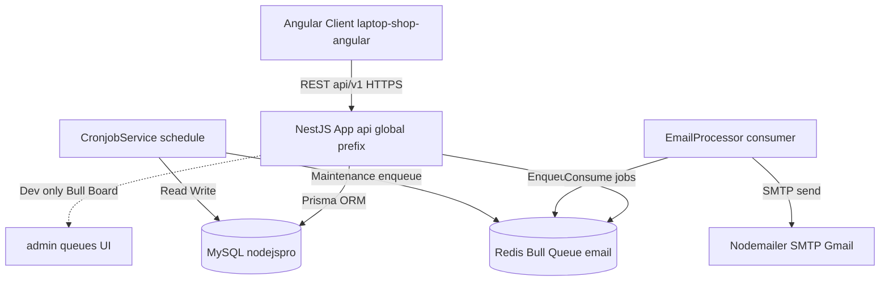
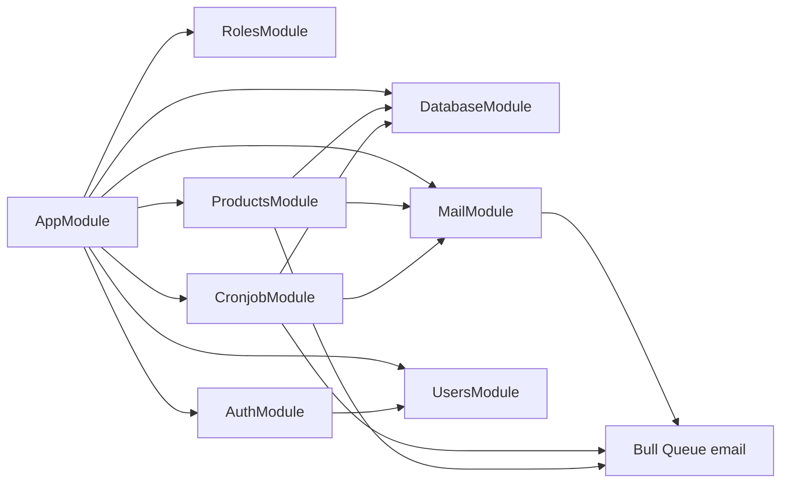
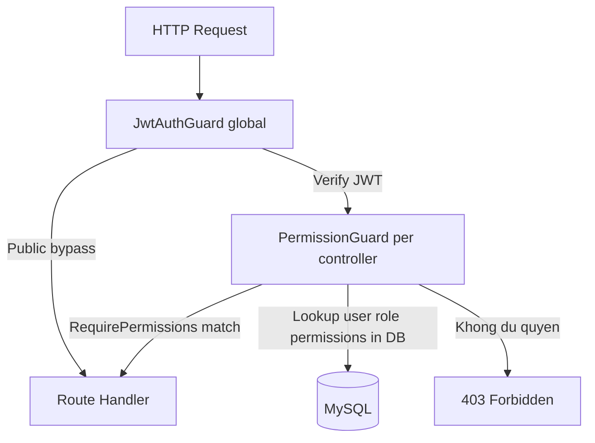
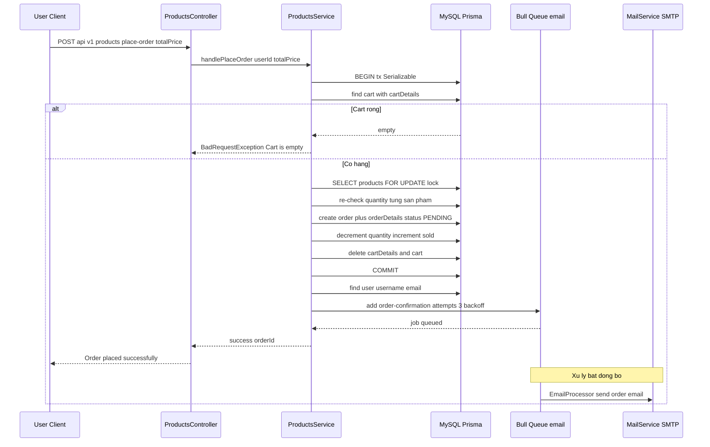
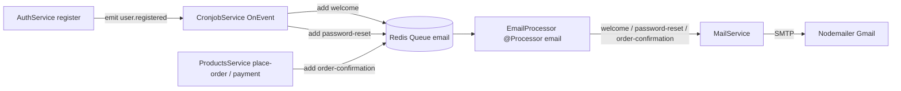
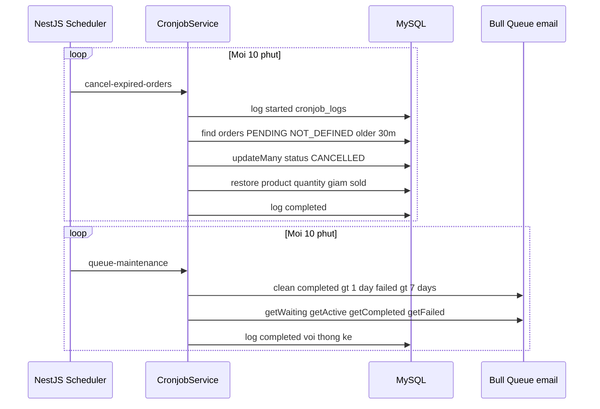

# Kiến trúc: laptop-shop

## TL;DR

Backend NestJS (monolith modular) cho cửa hàng laptop. Stack: NestJS 9 + Prisma 6 (MySQL) + Bull/Redis queue (gửi email bất đồng bộ) + `@nestjs/schedule` (cronjob hủy đơn quá hạn & bảo trì queue). Xác thực bằng JWT (Passport, access + refresh token), phân quyền theo Role-Permission (RBAC) qua guard global. Giao tiếp nội bộ phát/nhận sự kiện qua `EventEmitter2` (vd `user.registered` → welcome email).

Tài liệu này liên kết tới các đặc tả tính năng: [[04_API_Specs/FEA_001_Xac_Thuc|Xác thực]], [[04_API_Specs/FEA_002_Phan_Quyen|Phân quyền]], [[04_API_Specs/FEA_003_Cronjob_Hang_Doi_Email|Cronjob & Email]], [[04_API_Specs/FEA_004_San_Pham_Gio_Hang_Don_Hang|Sản phẩm & Đơn hàng]], [[04_API_Specs/FEA_005_Quan_Ly_Vai_Tro|Vai trò]], [[04_API_Specs/FEA_006_Quan_Ly_Nguoi_Dung|Người dùng]] và Schema DB.

## 1. Sơ đồ tổng quan (C4 — Container Level)

Bootstrap tại `src/main.ts`; mọi module được gom trong `src/app.module.ts`.

Bằng chứng:
- API prefix `api` + URI versioning v1: `src/main.ts:37-41`.
- Global JWT guard + validation pipe + transform interceptor: `src/main.ts:19-32`.
- Prisma/MySQL: `prisma/schema.prisma:5-8`; provider mysql, `DATABASE_URL` trong `.env.example:4`.
- Bull/Redis cấu hình global: `src/app.module.ts:25-44`; Redis host/port `.env.example:23-25`.
- Mailer SMTP: `src/mail/mail.module.ts:13-30`; biến MAIL_* `.env.example:16-20`.
- Bull Board (chỉ NODE_ENV=development) tại `/admin/queues`: `src/main.ts:44-60`.

## 2. Phân tầng & Module

Kiến trúc 3 tầng chuẩn NestJS: **Controller → Service → Prisma (data access)**. Cross-cutting: Guard global (JWT + Permission), Interceptor (transform response), Exception filter (`APP_FILTER`).

| Module/Area | Trách nhiệm | Nguồn |
|-------------|-------------|-------|
| `app.module` | Composition root: nạp Config (global), EventEmitter, Bull (global), các feature module; đăng ký `HttpExceptionFilter` global | `src/app.module.ts:18-63` |
| auth | Đăng nhập/đăng ký/refresh/logout, JWT (access+refresh), Passport local & jwt strategy, guards (Jwt, Local, Permission, Role, RefreshToken), quản lý Permission | `src/auth/auth.module.ts`, `src/auth/auth.service.ts`, `src/auth/auth.controller.ts`, `src/auth/guards/`, `src/auth/services/permission.service.ts` |
| users | CRUD người dùng, đổi mật khẩu, lưu/xóa refresh token | `src/users/users.controller.ts`, `src/users/users.service.ts` |
| roles | CRUD vai trò, gán permission cho role | `src/roles/roles.controller.ts`, `src/roles/roles.service.ts` |
| products | Sản phẩm (CRUD), giỏ hàng (cart/cartDetail), đặt hàng (place-order, transaction), lịch sử & chi tiết đơn, cập nhật payment method | `src/products/products.controller.ts`, `src/products/products.service.ts` |
| mail | Producer queue + consumer (`EmailProcessor`), gửi email welcome / password-reset / order-confirmation qua Nodemailer | `src/mail/mail.module.ts`, `src/mail/processors/email.processor.ts`, `src/mail/services/mail.service.ts` |
| cronjob | Tác vụ định kỳ (`@Cron`), lắng nghe event (`user.registered`), enqueue email, log job vào `cronjob_logs` | `src/cronjob/cronjob.module.ts`, `src/cronjob/services/cronjob.service.ts` |
| database | `PrismaService` (kết nối + soft delete helper), `DatabaseModule` | `src/database/prisma.service.ts`, `src/database/database.module.ts` |
| common / config / core | Decorators (`@Public`, `@User`, `@RequirePermissions`, `@ResponseMessage`), filters, validators, CORS config, `TransformInterceptor` | `src/common/`, `src/config/`, `src/core/transform.interceptor.ts` |

### Sơ đồ phụ thuộc module

Bằng chứng: `src/app.module.ts:45-52` (imports); ProductsService inject `email` queue + MailService `src/products/products.service.ts:18-22`; CronjobModule import MailModule + đăng ký queue `src/cronjob/cronjob.module.ts:10-20`; MailModule export queue `src/mail/mail.module.ts:32-34`.

### Lớp bảo mật (Guard chain)

Bằng chứng: JWT guard đăng ký global `src/main.ts:19-20`; `@Public()` bypass đọc qua Reflector; PermissionGuard truy vấn role→permissions `src/auth/guards/permission.guard.ts:27-54`; controller products gắn `@UseGuards(JwtAuthGuard, PermissionGuard)` và `@RequirePermissions(...)` `src/products/products.controller.ts:24-30`.

## 3. Luồng giao dịch tiêu biểu — Đặt hàng (place-order)

Endpoint `POST /api/v1/products/place-order` (`src/products/products.controller.ts:119-125`) → `handlePlaceOrder` (`src/products/products.service.ts:235-440`). Toàn bộ tạo đơn nằm trong một transaction Prisma isolation `Serializable`, có `SELECT ... FOR UPDATE` khóa product để chống race condition; email xác nhận gửi bất đồng bộ qua queue (fallback gửi đồng bộ nếu queue lỗi).

Lưu ý quan trọng (bằng chứng):
- Transaction Serializable + timeout 10s: `src/products/products.service.ts:344-347`.
- Khóa hàng `FOR UPDATE`: `:259-263`; re-check tồn kho: `:267-283`.
- Tạo order `status PENDING`, `paymentMethod NOT_DEFINED`, `paymentStatus PAYMENT_UNPAID`: `:286-311`.
- Trừ kho + tăng sold: `:314-328`; xóa cart: `:331-340`.
- Enqueue email `order-confirmation`, attempts 3, exponential backoff: `:363-393`.
- Fallback gửi email đồng bộ nếu enqueue lỗi: `:394-423` — không ném lỗi để không ảnh hưởng việc đặt hàng.

> Hoàn tất thanh toán là bước riêng: `PATCH /api/v1/products/order/:id/payment-method` cập nhật `status CONFIRM`, `paymentStatus PAYMENT_SUCCESS` và enqueue lại email xác nhận (`src/products/products.service.ts:480-573`).

## 4. Queue / Xử lý phi đồng bộ

Một queue Bull duy nhất tên **`email`** (Redis). Producer ở nhiều nơi, consumer tập trung tại `EmailProcessor`.

| Job name | Producer (enqueue) | Consumer | Mục đích |
|----------|--------------------|----------|----------|
| `welcome` | `CronjobService.queueWelcomeEmail` (`src/cronjob/services/cronjob.service.ts:156-179`), kích hoạt bởi event `user.registered` | `EmailProcessor.handleWelcomeEmail` (`src/mail/processors/email.processor.ts:31-49`) | Email chào mừng sau đăng ký |
| `password-reset` | `CronjobService.queuePasswordResetEmail` (`:181-206`) | `EmailProcessor.handlePasswordResetEmail` (`:51-73`) | Email đặt lại mật khẩu |
| `order-confirmation` | `ProductsService.handlePlaceOrder` (`src/products/products.service.ts:363-393`), `ProductsService.updatePaymentMethod` (`:555-562`), `CronjobService.queueOrderConfirmationEmail` (`src/cronjob/services/cronjob.service.ts:208-231`) | `EmailProcessor.handleOrderConfirmationEmail` (`src/mail/processors/email.processor.ts:75-96`) | Email xác nhận đơn hàng |

Cấu hình job phổ biến: `attempts: 3`, `backoff: exponential` (delay 2s–60s), một số job có `removeOnComplete/removeOnFail`. Khi job ném lỗi, Bull tự retry (`email.processor.ts:47, 71, 92`).

Bằng chứng event-driven: `AuthService.register` phát `user.registered` (`src/auth/auth.service.ts:59-64`) → `@OnEvent('user.registered')` trong CronjobService (`src/cronjob/services/cronjob.service.ts:23-27`). Queue khai báo `@Processor('email')` (`src/mail/processors/email.processor.ts:25`).

> Giám sát queue: **Bull Board** mount tại `/admin/queues` chỉ khi `NODE_ENV=development` (`src/main.ts:44-60`).

## 5. Cronjob / Tác vụ định kỳ

Đăng ký qua `ScheduleModule.forRoot()` (`src/cronjob/cronjob.module.ts:11`) + decorator `@Cron` trong `CronjobService`. Mỗi lần chạy được ghi log vào bảng `cronjob_logs` (started/completed/failed).

| Job (name) | Lịch | Tác vụ | Nguồn |
|------------|------|--------|-------|
| `cancel-expired-orders` | Mỗi 10 phút (`EVERY_10_MINUTES`) | Tìm order `PENDING` + `paymentMethod NOT_DEFINED` đã quá 30 phút → set `CANCELLED`, hoàn (increment) `quantity` và giảm (decrement) `sold` của product | `src/cronjob/services/cronjob.service.ts:32-112` |
| `queue-maintenance` | Mỗi 10 phút (`EVERY_10_MINUTES`) | Dọn job `completed` > 1 ngày và `failed` > 7 ngày; log thống kê waiting/active/completed/failed | `src/cronjob/services/cronjob.service.ts:115-152` |

Bằng chứng logging: `logJobStart/logJobCompleted/logJobFailed` ghi vào `prisma.cronjobLog` (`src/cronjob/services/cronjob.service.ts:330-379`); bảng `cronjob_logs` (`prisma/schema.prisma:186-201`).

## 6. Mô hình dữ liệu (tóm tắt)

Schema Prisma (MySQL) gồm: `User`, `Role`, `Permission`, `RolePermission` (RBAC); `Product`, `Cart`, `CartDetail`, `Order`, `OrderDetail` (thương mại); `EmailQueue`, `CronjobLog`, `Session` (hạ tầng/log). Soft delete qua cột `deletedAt` ở phần lớn bảng. Chi tiết ERD & data dictionary: Schema DB.

Bằng chứng: `prisma/schema.prisma` (toàn bộ); soft delete helper `prisma.softDelete` dùng tại `src/products/products.service.ts:102`.

## Source of truth

- Code: `/Users/nhatnguyen/Documents/Github/code-demo/laptop-shop`
- Catalog: `01_Raw/codebase/projects.json#laptop-shop`

## Liên kết

- [[Index]]
- [[04_API_Specs/FEA_001_Xac_Thuc|Xác thực]]
- [[04_API_Specs/FEA_002_Phan_Quyen|Phân quyền]]
- [[04_API_Specs/FEA_003_Cronjob_Hang_Doi_Email|Cronjob & Email]]
- [[04_API_Specs/FEA_004_San_Pham_Gio_Hang_Don_Hang|Sản phẩm & Đơn hàng]]
- [[04_API_Specs/FEA_005_Quan_Ly_Vai_Tro|Vai trò]]
- [[04_API_Specs/FEA_006_Quan_Ly_Nguoi_Dung|Người dùng]]
- Schema DB

## Cần human review

- Hạ tầng triển khai thực tế (reverse proxy/HTTPS, host Redis/MySQL): suy ra từ `.env.example`, chưa có `docker-compose.yml` trong repo để xác nhận topology.
- Bảng `EmailQueue` và `Session` tồn tại trong schema nhưng chưa thấy code thao tác trực tiếp (queue thực chạy qua Bull/Redis, không qua bảng `email_queue`) — cần xác nhận có phải di sản/để dành không.
