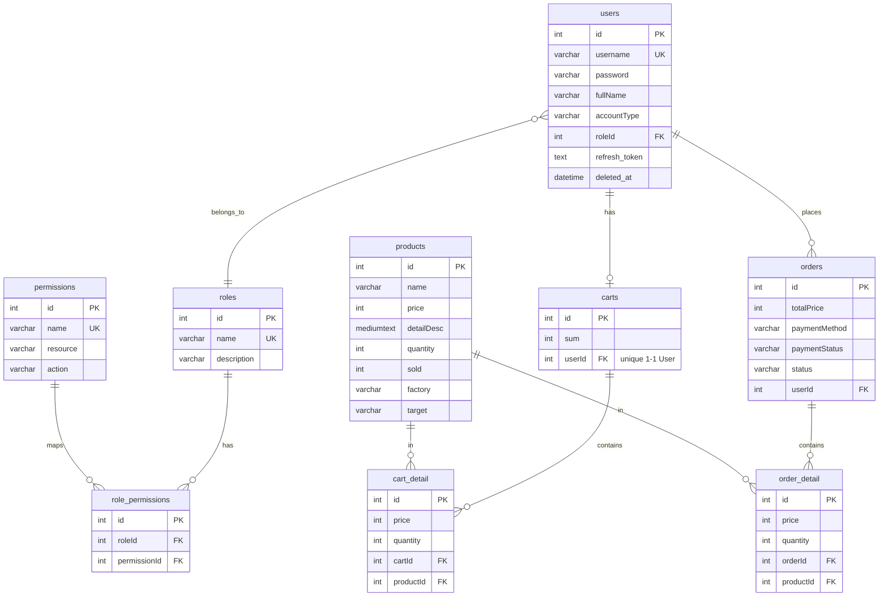

# Schema Design

**Stack:** MySQL 8.x · Prisma ORM 6 · driver `mysql2`
**Database name:** `nodejspro` (theo script `db:connect` trong `package.json`)
**Schema source:** `01_Raw/codebase/nestjs-backend/prisma/schema.prisma`

## ER Diagram



## Danh sách model

| Model (Prisma) | Bảng MySQL | Mục đích |
|----------------|------------|----------|
| `Session` | `Session` | Phiên đăng nhập (id, sid unique, data MEDIUMTEXT, expiresAt) |
| `User` | `users` | Tài khoản — soft delete (`deleted_at`), giữ `refresh_token` |
| `Role` | `roles` | Vai trò (admin, customer, …) |
| `Permission` | `permissions` | Quyền chi tiết `(resource, action)` |
| `RolePermission` | `role_permissions` | Bảng nối role ↔ permission |
| `Product` | `products` | Laptop (`factory`, `target`, `sold`) |
| `Order` | `orders` | Đơn hàng (`paymentStatus`, `status` mặc định `PENDING`) |
| `OrderDetail` | `order_detail` | Line items của order |
| `Cart` | `carts` | Giỏ hàng — 1-1 với User (`userId @unique`) |
| `CartDetail` | `cart_detail` | Line items của cart |
| `EmailQueue` | `email_queue` | Outbox email persistent — id `uuid`, `status`, `retryCount`, `data Json` |
| `CronjobLog` | `cronjob_logs` | Log job định kỳ (`jobName`, `status`, `duration`) |

## Convention chung
- **Soft delete**: `User`, `Role`, `Permission`, `Product`, `Order` có `deleted_at` nullable.
- **Audit columns**: hầu hết bảng có `created_at` + `updated_at` (đều `@map` snake_case).
- **PK mặc định**: `Int @id @default(autoincrement())`, trừ `Session` (string id) và `EmailQueue` (uuid).
- **Unique business keys**: `users.username`, `roles.name`, `permissions.name`, `permissions(resource, action)`, `role_permissions(roleId, permissionId)`, `carts.userId`.

## Index thứ cấp

| Bảng | Index |
|------|-------|
| `users` | `roleId` |
| `role_permissions` | `roleId`, `permissionId` |
| `order_detail` | `orderId`, `productId` |
| `cart_detail` | `cartId`, `productId` |
| `email_queue` | `status`, `scheduled_at`, `type` |
| `cronjob_logs` | `jobName`, `status`, `startTime` |

## Migrations
- Thư mục: `01_Raw/codebase/nestjs-backend/prisma/migrations/`
- Seed: `prisma/seed.ts` (chạy bằng `npm run prisma:seed`)
- Workflow:
  ```bash
  npm run prisma:migrate    # tạo migration + apply (dev)
  npm run prisma:push       # push schema không tạo migration
  npm run prisma:generate   # rebuild Prisma client
  ```

## Liên kết
- Flow xử lý email queue → [[Email_Queue_Flow]]
- API auth tham chiếu bảng `users` / `roles` → [[Auth_API]]
- Kiến trúc tổng → [[System_Overview]]
