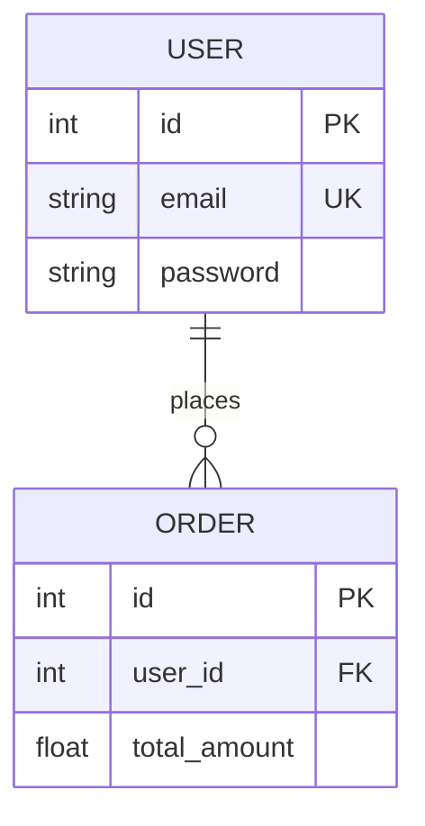

## 📂 Thư mục: 05_Database (Cơ sở dữ liệu & Schema Specs)

## 🎯 Tác dụng & Vai trò
Thư mục `05_Database/` lưu trữ toàn bộ các tài liệu mô tả **Mô hình Cơ sở dữ liệu (Database Schema)**, sơ đồ Thực thể - Mối quan hệ (Entity-Relationship Diagrams - ERD), từ điển dữ liệu (Data Dictionaries) và lịch sử nâng cấp cấu trúc dữ liệu (Migrations). Đây là nguồn thông tin cốt lõi giúp đội ngũ phát triển nắm được cấu trúc lưu trữ và tối ưu hóa truy vấn dữ liệu.

## 🗂️ Các thông tin chứa đựng
Thư mục này bao gồm:
1. **Sơ đồ ERD (Entity Relationship Diagrams)**: Sử dụng sơ đồ Mermaid để mô tả trực quan các bảng và mối liên kết (One-to-One, One-to-Many, Many-to-Many).
2. **Từ điển Dữ liệu (Data Dictionary)**: Liệt kê chi tiết từng bảng dữ liệu, các trường thông tin (Columns), kiểu dữ liệu (Data Types), khóa chính (Primary Key), khóa ngoại (Foreign Key), các ràng buộc (Constraints) và mô tả nghiệp vụ của trường đó.
3. **Đặc tả Schema gốc**: Ánh xạ trực tiếp từ các file schema thực tế của hệ thống (ví dụ: `schema.prisma` của Prisma, các file `.sql` của MySQL/Postgres).

## 📐 Cấu trúc & Quy tắc Định dạng
Các tài liệu đặc tả DB trong thư mục này được cấu trúc theo định dạng tự động hóa:

### 1. Quy trình sinh dữ liệu tự động (Automation)
Khi có thay đổi về cấu trúc cơ sở dữ liệu tại tệp mã nguồn đăng ký trong `01_Raw/database/schemas.json`, nhà phát triển có thể kích hoạt script tự động phân tích và sinh tài liệu:
1. Đọc tệp schema thực tế dựa trên đường dẫn local của dự án.
2. Trích xuất danh sách các model/table và phân tích mối quan hệ.
3. Tự động vẽ sơ đồ ERD bằng Mermaid và xuất ra tài liệu chi tiết.
- Lệnh thực thi:
  ```bash
  npm --prefix System run generate-graph
  ```

### 2. Sơ đồ thực thể mối quan hệ (ERD Mẫu)
Sử dụng cú pháp `erDiagram` của Mermaid:


### 3. Định dạng Frontmatter Mẫu
```yaml
---
title: "Schema: [Tên schema / Tên bảng]"
type: schema
source:
  - "01_Raw/database/schemas.json"
  - "local: <local_path_tới_schema_file>"
status: draft | reviewed | stale
last_synced: YYYY-MM-DD
tags:
  - database
  - schema
  - ERD
---
```

## 🔗 Liên kết Hữu ích
- [[Index]] — Quay lại Trang chủ chính.
- [[04_API_Specs/README|Đặc tả API & Logic]] — Các API thực hiện truy vấn và thay đổi dữ liệu trên các bảng này.
- [[03_Architecture/README|Kiến trúc Hệ thống]] — Cách thức lưu trữ dữ liệu tích hợp vào hạ tầng tổng thể.
