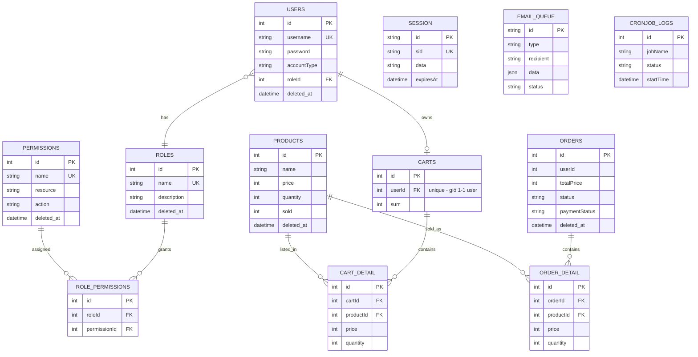

# Schema: laptop-shop-db · `mysql`

## TL;DR
Cơ sở dữ liệu của cửa hàng bán laptop, định nghĩa bằng Prisma trên MySQL với **12 bảng**. Gồm 4 cụm chính: (1) xác thực & phân quyền RBAC (`Session`, `users`, `roles`, `permissions`, `role_permissions`), (2) sản phẩm & giỏ hàng (`products`, `carts`, `cart_detail`), (3) đơn hàng (`orders`, `order_detail`), (4) hạ tầng nền (`email_queue`, `cronjob_logs`). Hầu hết bảng nghiệp vụ dùng **soft delete** qua `deleted_at`.

## Sơ đồ ERD

> Lưu ý ERD: `Session`, `email_queue`, `cronjob_logs` là bảng độc lập (không FK). Quan hệ `users`—`roles` thực chất là N—1 (mỗi user một role), nên trong sơ đồ vẽ `USERS }o--|| ROLES`. Quan hệ many-to-many `roles`↔`permissions` được hiện thực hóa qua bảng nối `role_permissions`.

## Từ điển dữ liệu (Data Dictionary)

### Bảng `Session` _(schema.prisma:10-17)_
Lưu phiên đăng nhập (session store dạng bảng). Không dùng tên bảng @@map nên giữ nguyên `Session`.

| Cột | Kiểu | Khóa/Ràng buộc | Nullable | Mô tả |
|-----|------|----------------|----------|-------|
| id | String | PK | No | Khóa chính của phiên _(schema.prisma:11)_ |
| sid | String | UK | No | Session ID duy nhất _(schema.prisma:12)_ |
| data | String (MediumText) | — | No | Dữ liệu phiên serialize _(schema.prisma:13)_ |
| expiresAt | DateTime | — | No | Thời điểm phiên hết hạn _(schema.prisma:14)_ |
| created_at | DateTime | default now() | No | Thời điểm tạo _(schema.prisma:15)_ |
| updated_at | DateTime | default now(), @updatedAt | No | Thời điểm cập nhật _(schema.prisma:16)_ |

### Bảng `users` _(schema.prisma:19-38)_
Tài khoản người dùng. Đọc/ghi qua module users (`users.service`) và auth.

| Cột | Kiểu | Khóa/Ràng buộc | Nullable | Mô tả |
|-----|------|----------------|----------|-------|
| id | Int | PK, autoincrement | No | Khóa chính _(schema.prisma:20)_ |
| username | String(255) | UK | No | Tên đăng nhập duy nhất _(schema.prisma:21)_ |
| password | String(255) | — | No | Mật khẩu đã hash _(schema.prisma:22)_ |
| fullName | String(255) | — | Yes | Họ tên đầy đủ _(schema.prisma:23)_ |
| address | String(255) | — | Yes | Địa chỉ _(schema.prisma:24)_ |
| phone | String(255) | — | Yes | Số điện thoại _(schema.prisma:25)_ |
| accountType | String(255) | — | No | Loại tài khoản (vd local/google) _(schema.prisma:26)_ |
| avatar | String(255) | — | Yes | Ảnh đại diện _(schema.prisma:27)_ |
| roleId | Int | FK → roles.id, default 1, index | No | Vai trò của user _(schema.prisma:28,31,36)_ |
| refresh_token | String (Text) | — | Yes | Refresh token JWT _(schema.prisma:29)_ |
| created_at | DateTime | default now() | No | Thời điểm tạo _(schema.prisma:32)_ |
| updated_at | DateTime | default now(), @updatedAt | No | Thời điểm cập nhật _(schema.prisma:33)_ |
| deleted_at | DateTime | — | Yes | Soft delete _(schema.prisma:34)_ |

_Quan hệ ngược: `cart Cart?` (1—0..1 tới carts) _(schema.prisma:30)_._

### Bảng `roles` _(schema.prisma:40-51)_
Vai trò RBAC. Đọc/ghi qua module roles.

| Cột | Kiểu | Khóa/Ràng buộc | Nullable | Mô tả |
|-----|------|----------------|----------|-------|
| id | Int | PK, autoincrement | No | Khóa chính _(schema.prisma:41)_ |
| description | String(255) | — | No | Mô tả vai trò _(schema.prisma:42)_ |
| name | String(100) | UK | No | Tên vai trò duy nhất _(schema.prisma:43)_ |
| created_at | DateTime | default now() | No | Thời điểm tạo _(schema.prisma:46)_ |
| updated_at | DateTime | default now(), @updatedAt | No | Thời điểm cập nhật _(schema.prisma:47)_ |
| deleted_at | DateTime | — | Yes | Soft delete _(schema.prisma:48)_ |

_Quan hệ ngược: `users User[]`, `permissions RolePermission[]` _(schema.prisma:44-45)_._

### Bảng `permissions` _(schema.prisma:53-66)_
Quyền hạn theo cặp resource + action.

| Cột | Kiểu | Khóa/Ràng buộc | Nullable | Mô tả |
|-----|------|----------------|----------|-------|
| id | Int | PK, autoincrement | No | Khóa chính _(schema.prisma:54)_ |
| name | String(100) | UK | No | Tên quyền duy nhất _(schema.prisma:55)_ |
| description | String(255) | — | No | Mô tả quyền _(schema.prisma:56)_ |
| resource | String(100) | UK (resource+action) | No | Tài nguyên: users, products, orders... _(schema.prisma:57,64)_ |
| action | String(50) | UK (resource+action) | No | Hành động: create, read, update, delete, list _(schema.prisma:58,64)_ |
| created_at | DateTime | default now() | No | Thời điểm tạo _(schema.prisma:60)_ |
| updated_at | DateTime | default now(), @updatedAt | No | Thời điểm cập nhật _(schema.prisma:61)_ |
| deleted_at | DateTime | — | Yes | Soft delete _(schema.prisma:62)_ |

_Ràng buộc unique kép `@@unique([resource, action])` _(schema.prisma:64)_._

### Bảng `role_permissions` _(schema.prisma:68-80)_
Bảng nối many-to-many giữa `roles` và `permissions`.

| Cột | Kiểu | Khóa/Ràng buộc | Nullable | Mô tả |
|-----|------|----------------|----------|-------|
| id | Int | PK, autoincrement | No | Khóa chính _(schema.prisma:69)_ |
| roleId | Int | FK → roles.id (onDelete Cascade), index | No | Vai trò _(schema.prisma:70,72,77)_ |
| permissionId | Int | FK → permissions.id (onDelete Cascade), index | No | Quyền _(schema.prisma:71,73,78)_ |
| created_at | DateTime | default now() | No | Thời điểm tạo _(schema.prisma:74)_ |

_Ràng buộc unique kép `@@unique([roleId, permissionId])` _(schema.prisma:76)_. Xóa role/permission sẽ cascade xóa dòng nối._

### Bảng `orders` _(schema.prisma:82-100)_
Đơn hàng. Lưu thông tin người nhận và trạng thái thanh toán/giao hàng.

| Cột | Kiểu | Khóa/Ràng buộc | Nullable | Mô tả |
|-----|------|----------------|----------|-------|
| id | Int | PK, autoincrement | No | Khóa chính _(schema.prisma:83)_ |
| totalPrice | Int | — | No | Tổng tiền đơn _(schema.prisma:84)_ |
| paymentMethod | String | — | No | Phương thức thanh toán _(schema.prisma:85)_ |
| paymentRef | String | — | Yes | Mã tham chiếu thanh toán _(schema.prisma:86)_ |
| paymentStatus | String | — | No | Trạng thái thanh toán _(schema.prisma:87)_ |
| receiverAddress | String(255) | — | No | Địa chỉ người nhận _(schema.prisma:88)_ |
| receiverName | String(255) | — | No | Tên người nhận _(schema.prisma:89)_ |
| receiverPhone | String(255) | — | No | SĐT người nhận _(schema.prisma:90)_ |
| receiverMail | String(255) | default "" | No | Email người nhận _(schema.prisma:91)_ |
| status | String | default "PENDING" | No | Trạng thái đơn _(schema.prisma:92)_ |
| userId | Int | — (không khai báo @relation) | No | Người đặt; ⚠️ không có FK constraint khai báo trong schema _(schema.prisma:93)_ |
| created_at | DateTime | default now() | No | Thời điểm tạo _(schema.prisma:95)_ |
| updated_at | DateTime | default now(), @updatedAt | No | Thời điểm cập nhật _(schema.prisma:96)_ |
| deleted_at | DateTime | — | Yes | Soft delete _(schema.prisma:97)_ |

_Quan hệ ngược: `orderDetails OrderDetail[]` _(schema.prisma:94)_._

### Bảng `order_detail` _(schema.prisma:102-116)_
Dòng chi tiết của đơn hàng (snapshot giá + số lượng tại thời điểm đặt).

| Cột | Kiểu | Khóa/Ràng buộc | Nullable | Mô tả |
|-----|------|----------------|----------|-------|
| id | Int | PK, autoincrement | No | Khóa chính _(schema.prisma:103)_ |
| price | Int | — | No | Giá tại thời điểm đặt _(schema.prisma:104)_ |
| quantity | Int | — | No | Số lượng _(schema.prisma:105)_ |
| orderId | Int | FK → orders.id, index | No | Đơn hàng cha _(schema.prisma:106,108,113)_ |
| productId | Int | FK → products.id, index | No | Sản phẩm _(schema.prisma:107,109,114)_ |
| created_at | DateTime | default now() | No | Thời điểm tạo _(schema.prisma:110)_ |
| updated_at | DateTime | default now(), @updatedAt | No | Thời điểm cập nhật _(schema.prisma:111)_ |

### Bảng `products` _(schema.prisma:118-136)_
Danh mục sản phẩm laptop. Đọc/ghi qua module products (`products.service`).

| Cột | Kiểu | Khóa/Ràng buộc | Nullable | Mô tả |
|-----|------|----------------|----------|-------|
| id | Int | PK, autoincrement | No | Khóa chính _(schema.prisma:119)_ |
| name | String(255) | — | No | Tên sản phẩm _(schema.prisma:120)_ |
| price | Int | — | No | Giá bán _(schema.prisma:121)_ |
| image | String(255) | — | Yes | Ảnh sản phẩm _(schema.prisma:122)_ |
| detailDesc | String (MediumText) | — | No | Mô tả chi tiết _(schema.prisma:123)_ |
| shortDesc | String(255) | — | No | Mô tả ngắn _(schema.prisma:124)_ |
| quantity | Int | — | No | Tồn kho _(schema.prisma:125)_ |
| sold | Int | default 0 | Yes | Số lượng đã bán _(schema.prisma:126)_ |
| factory | String(255) | — | No | Hãng sản xuất _(schema.prisma:127)_ |
| target | String(255) | — | No | Đối tượng / nhu cầu sử dụng _(schema.prisma:128)_ |
| created_at | DateTime | default now() | No | Thời điểm tạo _(schema.prisma:131)_ |
| updated_at | DateTime | default now(), @updatedAt | No | Thời điểm cập nhật _(schema.prisma:132)_ |
| deleted_at | DateTime | — | Yes | Soft delete _(schema.prisma:133)_ |

_Quan hệ ngược: `cartDetails CartDetail[]`, `orderDetails OrderDetail[]` _(schema.prisma:129-130)_._

### Bảng `carts` _(schema.prisma:138-148)_
Giỏ hàng. Mỗi user có tối đa một giỏ (userId unique).

| Cột | Kiểu | Khóa/Ràng buộc | Nullable | Mô tả |
|-----|------|----------------|----------|-------|
| id | Int | PK, autoincrement | No | Khóa chính _(schema.prisma:139)_ |
| sum | Int | — | No | Tổng số mặt hàng/tổng tiền giỏ _(schema.prisma:140)_ |
| userId | Int | FK → users.id, UK | No | Chủ sở hữu giỏ (1—1) _(schema.prisma:141,143)_ |
| created_at | DateTime | default now() | No | Thời điểm tạo _(schema.prisma:144)_ |
| updated_at | DateTime | default now(), @updatedAt | No | Thời điểm cập nhật _(schema.prisma:145)_ |

_Quan hệ ngược: `cartDetails CartDetail[]` _(schema.prisma:142)_._

### Bảng `cart_detail` _(schema.prisma:150-164)_
Dòng chi tiết trong giỏ hàng.

| Cột | Kiểu | Khóa/Ràng buộc | Nullable | Mô tả |
|-----|------|----------------|----------|-------|
| id | Int | PK, autoincrement | No | Khóa chính _(schema.prisma:151)_ |
| price | Int | — | No | Giá đơn vị _(schema.prisma:152)_ |
| quantity | Int | — | No | Số lượng _(schema.prisma:153)_ |
| cartId | Int | FK → carts.id, index | No | Giỏ hàng cha _(schema.prisma:154,156,161)_ |
| productId | Int | FK → products.id, index | No | Sản phẩm _(schema.prisma:155,157,162)_ |
| created_at | DateTime | default now() | No | Thời điểm tạo _(schema.prisma:158)_ |
| updated_at | DateTime | default now(), @updatedAt | No | Thời điểm cập nhật _(schema.prisma:159)_ |

### Bảng `email_queue` _(schema.prisma:166-184)_
Hàng đợi gửi email (welcome, password-reset, order-confirmation). Xử lý bởi cronjob/worker.

| Cột | Kiểu | Khóa/Ràng buộc | Nullable | Mô tả |
|-----|------|----------------|----------|-------|
| id | String | PK, default uuid() | No | Khóa chính UUID _(schema.prisma:167)_ |
| type | String(50) | index | No | Loại email _(schema.prisma:168,182)_ |
| recipient | String(255) | — | No | Người nhận _(schema.prisma:169)_ |
| data | Json | — | No | Dữ liệu email dạng JSON _(schema.prisma:170)_ |
| retryCount | Int | default 0 | No | Số lần đã thử lại _(schema.prisma:171)_ |
| maxRetries | Int | default 3 | No | Số lần thử tối đa _(schema.prisma:172)_ |
| status | String(20) | default "pending", index | No | pending/processing/sent/failed _(schema.prisma:173,180)_ |
| error | String (Text) | — | Yes | Thông tin lỗi nếu fail _(schema.prisma:174)_ |
| scheduled_at | DateTime | default now(), index | No | Thời điểm dự kiến gửi _(schema.prisma:175,181)_ |
| processed_at | DateTime | — | Yes | Thời điểm đã xử lý _(schema.prisma:176)_ |
| created_at | DateTime | default now() | No | Thời điểm tạo _(schema.prisma:177)_ |
| updated_at | DateTime | default now(), @updatedAt | No | Thời điểm cập nhật _(schema.prisma:178)_ |

### Bảng `cronjob_logs` _(schema.prisma:186-201)_
Nhật ký chạy cronjob (giám sát tác vụ nền).

| Cột | Kiểu | Khóa/Ràng buộc | Nullable | Mô tả |
|-----|------|----------------|----------|-------|
| id | Int | PK, autoincrement | No | Khóa chính _(schema.prisma:187)_ |
| jobName | String(100) | index | No | Tên job _(schema.prisma:188,197)_ |
| status | String(20) | index | No | started/completed/failed _(schema.prisma:189,198)_ |
| startTime | DateTime | index | No | Thời điểm bắt đầu _(schema.prisma:190,199)_ |
| endTime | DateTime | — | Yes | Thời điểm kết thúc _(schema.prisma:191)_ |
| duration | Int | — | Yes | Thời lượng (ms) _(schema.prisma:192)_ |
| error | String (Text) | — | Yes | Thông tin lỗi _(schema.prisma:193)_ |
| details | Json | — | Yes | Chi tiết bổ sung dạng JSON _(schema.prisma:194)_ |
| created_at | DateTime | default now() | No | Thời điểm tạo _(schema.prisma:195)_ |

## Quan hệ chính
- `users` N—1 `roles` _(roleId → roles.id)_ — mỗi user thuộc một vai trò, mặc định roleId=1 _(schema.prisma:28,31)_.
- `roles` N—N `permissions` qua bảng nối `role_permissions` _(roleId, permissionId; onDelete Cascade)_ — mô hình RBAC _(schema.prisma:72-73)_.
- `users` 1—1 `carts` _(carts.userId UK → users.id)_ — mỗi user một giỏ hàng _(schema.prisma:141,143)_.
- `carts` 1—N `cart_detail` _(cartId → carts.id)_, và `cart_detail` N—1 `products` _(productId → products.id)_ _(schema.prisma:156-157)_.
- `orders` 1—N `order_detail` _(orderId → orders.id)_, và `order_detail` N—1 `products` _(productId → products.id)_ _(schema.prisma:108-109)_.
- `orders.userId` tham chiếu người đặt nhưng **không khai báo `@relation`** trong schema → ⚠️ không có FK constraint cấp Prisma, cần review _(schema.prisma:93)_.

## Ghi chú thiết kế
- **Soft delete** qua cột `deleted_at` ở: `users`, `roles`, `permissions`, `orders`, `products`. Các bảng còn lại (chi tiết, log, queue, session) xóa cứng.
- **Unique constraints**: `Session.sid`, `users.username`, `roles.name`, `permissions.name`, `carts.userId`, kép `permissions(resource, action)` và `role_permissions(roleId, permissionId)`.
- **Index** (FK + tra cứu): `users(roleId)`, `role_permissions(roleId, permissionId)`, `order_detail(orderId, productId)`, `cart_detail(cartId, productId)`, `email_queue(status, scheduledAt, type)`, `cronjob_logs(jobName, status, startTime)`.
- **Khóa chính không số**: `Session.id` (String), `email_queue.id` (UUID); các bảng khác dùng Int autoincrement.
- **Snapshot giá**: `order_detail.price` và `cart_detail.price` lưu giá tại thời điểm thêm, độc lập với `products.price`.

## Source of truth
- Schema file: `/Users/nhatnguyen/Documents/Github/code-demo/laptop-shop/prisma/schema.prisma`
- Catalog: `01_Raw/database/schemas.json`

## Liên kết
- [[04_API_Specs/FEA_004_San_Pham_Gio_Hang_Don_Hang|API Đơn hàng]] — đọc/ghi `products`, `carts`, `cart_detail`, `orders`, `order_detail`.
- [[04_API_Specs/FEA_001_Xac_Thuc|Xác thực]] — `users`, `Session`, refresh token.
- [[04_API_Specs/FEA_005_Quan_Ly_Vai_Tro|Vai trò]] — `roles`, `permissions`, `role_permissions`.
- [[01_Business/Dat_Hang|Nghiệp vụ đặt hàng]] — luồng nghiệp vụ tạo đơn.
- [[03_Architecture/laptop-shop_Architecture|Kiến trúc BE]] — sơ đồ kiến trúc backend.
